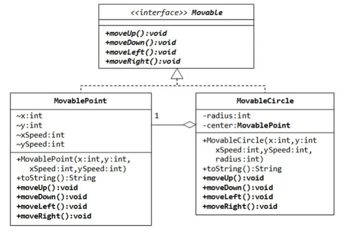

# Ejercicios tipo parcial 1

1. Dado el siguiente diagrama UML, explicar las relaciones entre las clases:
    
    
    
2. Dado el siguiente código:
    1. Explicar por qué el valor de `counter` no es 0 al imprimirlo.
    2. ¿Cómo se puede arreglar la implementación para asegurar que `counter` valga 0?
    
    ```java
    public class Main {
        private static int counter = 0;
        
        public static void main(String[] args) throws InterruptedException {
            Thread thread1 = new Thread(() -> {
                for (int i = 0; i < 1000; i++) {
                    counter++;
                }
            });
    
            Thread thread2 = new Thread(() -> {
                for (int i = 0; i < 1000; i++) {
                    counter--;
                }
            });
    
            thread1.start();
            thread2.start();
    
            thread1.join();
            thread2.join();
    
            System.out.println("Final counter value: " + counter);
        }
    }
    ```
    
3. Dado el siguiente código:
    1. ¿En qué momento se crea una instancia de `App` y se invoca el método `start`?
    2. Mostrar el árbol de componentes o *scene graph.*
    3. Dibujar la ventana como se verá en la pantalla inmediatemente luego de arrancar la aplicación.
    4. La firma del método `setOnAction` es `void setOnAction(EventHandler<ActionEvent>)`. Explicar en detalle qué hace la sintaxis `e -> { ... }`.
    
    ```java
    public class App extends Application {
        Label texto = new Label();
        int n = 0;
    
        @Override
        public void start(Stage stage) {
            var btn = new Button("Comprar canica");
            btn.setOnAction(e -> {
                n++;
                texto.setText("Tengo %d canicas".formatted(n));
            });
    
            var vbox = new VBox(texto, btn);
    
            var scene = new Scene(vbox, 640, 480);
            stage.setScene(scene);
            stage.show();
        }
    
        public static void main(String[] args) {
            launch();
        }
    }
    ```
    
4. a. Explicar cuál es el propósito de cada uno de los componentes del patrón MVC: Modelo, Vista, Controlador.
    
    b. Clasificar cada una de las siguientes clases en M, V o C:
    
    ```java
    class UI {
      private Contador c;
      public UI(Contador c) { this.c = c; }
      void mostrar() { System.out.printf("La cuenta actual es: %d", c.get()); }
      void esperar() { new Scanner(System.in).nextLine(); }
    }
    
    class Contador {
      private int n = 0;
      public void incrementar() { n++; }
      public int get() { return n; }
    }
    
    class Main {
      public static void main(String[] args) {
        var c = new Contador();
        var ui = new UI(c);
        while (true) {
          ui.mostrar();
          ui.esperar();
          c.incrementar();
        }
      }
    }
    ```
