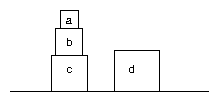

# Ejercicios tipo parcial 2

1. Dado el siguiente razonamiento:

   > ∀X. ∀Y. (rivales(X, Y) ∩ ¬gana(X) ⊃ se_alegra(Y))<br>
   > gana(trump) ⊃ ¬gana(biden)<br>
   > rivales(trump, lula)<br>
   > gana(biden)<br>
   > ―――――――――――――――――――――――<br>
   > 𐬽 se_alegra(lula)

   Pruébelo mediante demostración no natural por refutación, siguiendo una
   estrategia similar a la de Prolog.


1. Dado:

    ```
    or = λx. λy. ((x true) y)
    true = λx.λy.x
    false = λx.λy.y
    ```

    Probar que: `or false true = true`

1. Escribir una base de datos que represente el siguiente conjunto de bloques:

    

    La base de datos debe incluir los nombres `a`, `b`, `c`, `d` y `mesa` y el
    predicado `apoyado/2`, que representa la relación de que un objeto está apoyado
    sobre otro.

    Dado el predicado `encima/2`, ¿Qué consulta haría para encontrar todos los
    bloques que están encima del bloque `c`? Mostrar los resultados que daría
    el intérprete **en el orden correcto**. Justificar.

    ```prolog
    encima(X, Y) :- apoyado(X, Y).
    encima(X, Y) :- apoyado(X, Z), encima(Z, Y).
    ```

1. Dada la definición de la siguiente clase en un lenguaje multiparadigma
   imaginario (que soporta al menos los paradigmas de objetos y
   funcional):

    ```java
    class Resultado<T> {
        // invariante: o bien valor != null, o excepcion != null (exclusivo)
        T valor;
        Exception excepcion;

        constructor(T v) {
            this.valor = v
        }

        constructor(Exception e) {
            this.excepcion = e
        }

        public Resultado<R> bind(...) {
            ...
        }
    }
    ```

    Si la clase representa una mónada y los constructores corresponden a la
    operación monádica `return`, indicar qué debería recibir el método `bind` y cuál
    sería su cuerpo.

1. Mostrar el resultado de evaluar las siguientes expresiones en Clojure.
   Justificar.

   {: .partes}
   1. ```clojure
      user=> (defn f [x]
               (reduce * (range 1 (inc x))))
      user=> (f 5)
      ```

    1. ```clojure
       user=> (map #(% 0) [inc dec zero?])
       ```

    1. ```clojure
       user=> (defn palitos [n]
                (apply str
                        (concat
                        (repeat (quot n 5) "卌")
                        (repeat (mod n 5) "|"))))
       user=> (palitos 8)
       ```
