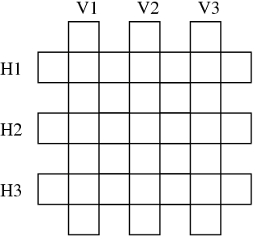

# Programación lógica
{: .no_toc }

## Índice
{: .no_toc .text-delta }

1. Índice
{:toc}

## Magos

Sea la siguiente base de datos:

```prolog
mago(ron).
tieneVarita(harry).
juegaQuidditch(harry).
mago(X):- tieneEscoba(X), tieneVarita(X).
tieneEscoba(X):- juegaQuidditch(X).
```

Cómo responde Prolog a las siguientes consultas?

```prolog
mago(ron).
bruja(ron).
mago(hermione).
bruja(hermione).
mago(harry).
mago(Y).
bruja(Y).
```

## Oraciones

Sea la siguiente base de datos:

```
palabra(determinante,el).
palabra(determinante,un).
palabra(nucleo,pez).
palabra(nucleo,'alfajor triple').
palabra(verbo,come).
palabra(verbo,compra).

oracion(Palabra1,Palabra2,Palabra3,Palabra4,Palabra5):-
   palabra(determinante,Palabra1),
   palabra(nucleo,Palabra2),
   palabra(verbo,Palabra3),
   palabra(determinante,Palabra4),
   palabra(nucleo,Palabra5).
```

¿Qué consulta hay que hacer para averiguar todas las oraciones posibles?
Listar los resultados que generará Prolog en el orden esperado.

## Crucigrama

Sean las palabras en italiano:

```
astante , astoria , baratto , cobalto , pistola , statale .
```

Se desea aplicarlas en el siguiente crucigrama:



Escribir una base de datos y una consulta que encuentre una solución al problema.

## Trenes

Sean las siguientes cláusulas que describen algunas localidades que están
conectadas con un tramo de tren:

```
trenDirecto(saarbruecken,dudweiler).
trenDirecto(forbach,saarbruecken).
trenDirecto(freyming,forbach).
trenDirecto(stAvold,freyming).
trenDirecto(fahlquemont,stAvold).
trenDirecto(metz,fahlquemont).
trenDirecto(nancy,metz).
```

Escribir un predicado `viajar/2` que permita averiguar si es posible o no viajar de una
localidad a otra, ya sea en uno o más tramos de tren. Por ejemplo,
`viajar(nancy,saarbruecken)` debe dar verdadero.

## Árbol binario

Sea la siguiente representación de un árbol binario:
* Una hoja se representa con `hoja(Valor)`. Por ejemplo: `hoja(3)`, `hoja(7)`.
* Dados dos árboles `B1` y `B2` se pueden combinar con `arbol(B1, B2)`.

Definir el predicado `espejo/2` que produzca la imagen espejada de un árbol
binario. Por ejemplo:

```prolog
?- espejo(arbol(arbol(hoja(1), hoja(2)), hoja(4)), T).
T = arbol(hoja(4), arbol(hoja(2), hoja(1))).
```

## Traducir

Sea la siguiente base de datos:

```prolog
traduccion(eins,uno).
traduccion(zwei,dos).
traduccion(drei,tres).
traduccion(vier,cuatro).
traduccion(fuenf,cinco).
traduccion(sechs,seis).
traduccion(sieben,siete).
traduccion(acht,ocho).
traduccion(neun,nueve).
```

Escribir el predicado `traduccionLista(A,E)` que produzca la traducción de una
lista de números etre alemán y español. Por ejemplo,

``` prolog
?- traduccionLista([eins,neun,zwei], X).
X = [uno,nueve,dos].
?- traduccionLista(X, [uno,siete,seis,dos]).
X = [eins,sieben,sechs,zwei].
```

## Lista duplicada

Una lista es duplicada si está compuesta por dos bloques consecutivos de
los mismos elementos. Por ejemplo `[a,b,c,a,b,c]` es duplicada. Escribir un
predicado `duplicada(Lista)` que determine si la lista es duplicada o no.

## Palíndromo

Escribir el predicado `palindromo(Lista)` que determine si la lista es
palindrómica. Por ejemplo: `palindromo([n,e,u,q,u,e,n])` debe dar verdadero.

## Acertijo

{: .label }
Difícil

En una calle hay tres casas contiguas de diferentes colores: rojo, azul y
verde. Sus habitantes son de diferentes nacionalidades, y tienen una mascota
diferente. Aquí hay algunos hechos conocidos:

* Los uruguayos vive en la casa roja.
* El jaguar es la mascota de la familia española.
* Los japonenes viven a la derecha de los que tienen un caracol.
* Los dueños del caracol viven a la izquierda de la casa azul.

¿Quién tiene una cebra? Escribir un predicado `cebra/1` que indique la
nacionalidad de los dueños de la cebra.
