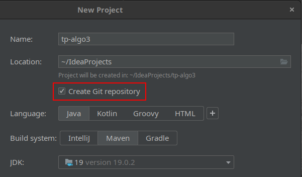

# Uso de Git y Github

Para los TPs es obligatorio usar Github (y consecuentemente Git).

## ¿Qué es Git?

[Git](https://git-scm.com/) es un sistema de control de versiones. Tiene dos
propósitos principales:

- **Control de versiones**

    Permite alojar el código en un
    [repositorio](https://git-scm.com/book/en/v2/Git-Basics-Getting-a-Git-Repository)
    y así llevar un historial de cambios, de forma tal de que podamos hacer
    cosas como:

    - Volver a una versión anterior del código

    - Ver las diferencias entre dos versiones del código

    - Tener dos o más “ramificaciones” de desarrollo
      ([branches](https://git-scm.com/book/en/v2/Git-Branching-Branches-in-a-Nutshell)),
      a partir de una versión común

- **Facilitar el trabajo en equipo**

    Permite que dos o más personas puedan hacer cambios en forma simultánea, y
    luego juntar esos dos cambios en una versión común.

## ¿Qué es Github?

[Github](https://github.com/) es un sitio web que permite alojar repositorios Git. Facilita entre otras cosas:

- Compartir repositorios Git en forma privada, entre dos o más usuarios
- Compartir repositorios Git en forma pública
- Hacer *[pull requests](https://docs.github.com/en/pull-requests/collaborating-with-pull-requests/proposing-changes-to-your-work-with-pull-requests/about-pull-requests)*
- Llevar un registro de [issues](https://docs.github.com/en/issues/tracking-your-work-with-issues/about-issues) (bugs, problemas a solucionar, tareas, etc)

## ¿Qué es lo mínimo que tengo que saber para el TP?

### Crear el repositorio en Github

1. [Crear una cuenta](https://github.com/signup) en Github

    En adelante nos referiremos al nombre de usuario como `<usuario>`.

2. [Crear un reposiorio](https://github.com/new)

    - **Repository name**: `algo3-tp-2023c1` (o cualquier otra cosa)

        En adelante nos referiremos a este nombre como `<repo>`.

    - Tildar **Private**

    - Click en **Create Repository**

3. Agregar a los integrantes del grupo y docentes como colaboradores

    1. Click en **Settings**

    2. Click en **Collaborators (**ingresar la contraseña si la pide)

    3. Click en **Add people**

    4. Repetir con los integrantes del grupo y al menos `dessaya`: por cada uno hay que hacer click en **Invite collaborator**

### Conectar Github con IntelliJ IDEA

Suponiendo que el repositorio ya está creado en Github:

1. Crear un proyecto nuevo en **IntelliJ IDEA**, tildando la opción **Create
   Git repository**. (Y, como siempre, seleccionar **Maven** como Build
   System).

    

2. Notar que el proyecto creado incluye un archivo llamado `.gitignore`. En
   caso de que no sea así, crear un archivo llamado `.gitignore` con [este
   contenido](https://raw.githubusercontent.com/github/gitignore/main/Global/JetBrains.gitignore).

3. Click derecho en el proyecto **→ Git → Manage Remotes…**

    1. Click en **+**

    2. Name: `origin`

    3. URL: `git@github.com:<usuario>/<repo>.git`

A partir de ahora se puede utilizar Git desde el menú contextual o desde la
pestaña Git (**View → Tool windows → Git**).

### Uso de Git

Git es una herramienta sumamente poderosa, pero su complejidad hace que sea
imposible resumirla en un solo tutorial. Hay mucha información disponible en
Internet sobre Git.

- [Git book](https://git-scm.com/book/en/v2)
- [Git book en español](https://git-scm.com/book/es/v2)

Git se puede utilizar desde la IDE o desde diferentes [interfaces
gráficas](https://git-scm.com/book/en/v2/Appendix-A%3A-Git-in-Other-Environments-Graphical-Interfaces),
pero lo más recomendado suele ser aprender a usarlo desde la **consola**. En
cualquier caso lo importante es aprender los comandos básicos:

- Para trabajar en forma **individual** vas a tener que entender por lo menos:
    - `git add` y `git commit` (para guardar cambios en el repositorio)
    - `git push` (para subir los últimos cambios a Github)
- Para trabajar en forma **grupal**, además:
    - `git pull` (para descargar de Github los últimos cambios)
- Además, es recomendable entender:
    - `git status` , `git log` y `git show` (para ver el estado del repositorio y navegar el historial de cambios)
    - `git branch` y `git merge` (para trabajar con ramificaciones)
    - `git checkout` y `git reset` (para deshacer cambios)
    - El uso de *[issues](https://docs.github.com/en/issues/tracking-your-work-with-issues/about-issues)* y *[pull requests](https://docs.github.com/en/pull-requests/collaborating-with-pull-requests/proposing-changes-to-your-work-with-pull-requests/about-pull-requests)* en Github (para que un grupo de personas pueda colaborar más efectivamente)

