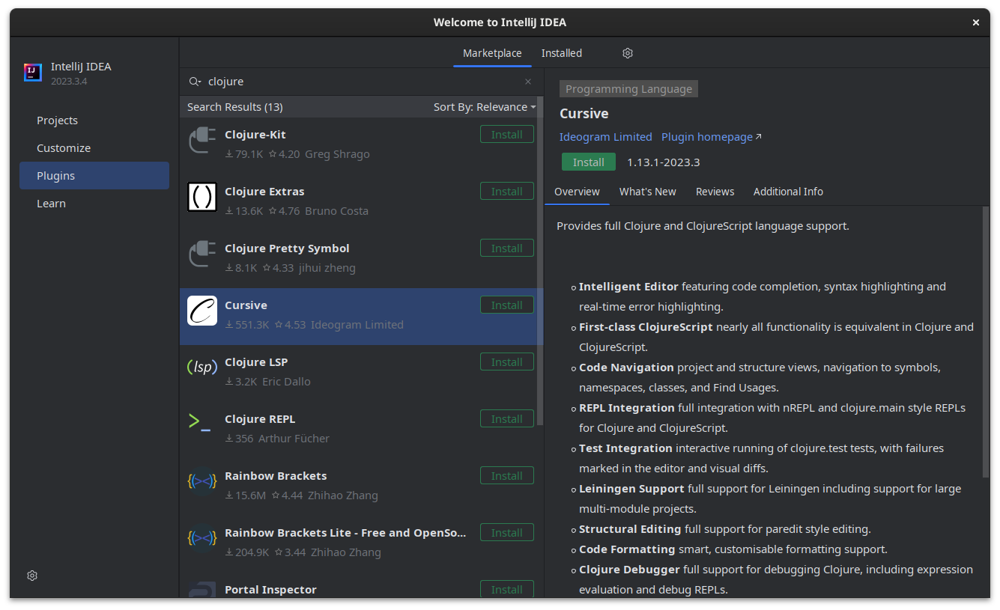
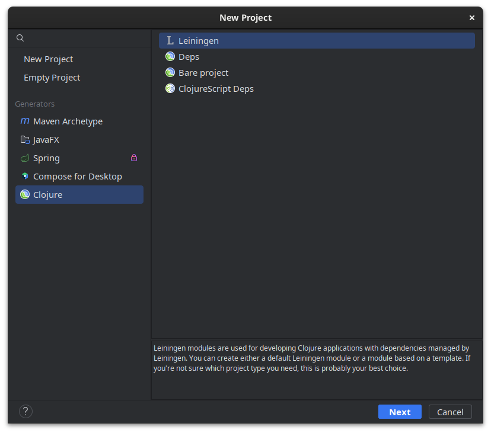

# Tutorial: Clojure

## Leiningen

[Leiningen](https://leiningen.org/) es una herramienta utilizada para manejar
proyectos en Clojure. Sería como el equivalente de Maven para Clojure.

Tanto Clojure como Leiningen puede ser utilizados desde una IDE como IntelliJ
IDEA o desde la consola.

## IntelliJ IDEA

En IntelliJ IDEA es posible utilizar un plugin que instala automáticamente
Clojure y Leiningen.

1. Abrir la pantalla de configuración de **Plugins** (desde la pantalla de inicio, o en **Menu** →
   **Settings...** → **Plugins**).

   1. Click en **Marketplace**
   1. Buscar el plugin **Cursive**
   1. Click en **Install**
   1. Cuando termine la instalación, reiniciar IntelliJ.

   

1. Al crear un **nuevo proyecto**, seleccionar **Clojure** y **Leiningen**, y
   click en **Next**. Luego completar los datos del proyecto (nombre,
   ubicación, etc.).

   

1. **Cursive** se puede probar por 30 días, y luego de ese período requiere
   la adquisición de una **licencia**. Se puede obtener una licencia gratuita
   para uso no comercial:

   1. Ir a [https://cursive-ide.com/buy.html](https://cursive-ide.com/buy.html)
   1. Elegir **Non-Commercial licence**
   1. Ingresar nombre y email.
   1. Se recibirá la licencia en la casilla de mail.
   1. En IntelliJ, ir a **Menu** → **Help** → **Register Cursive...**
   1. Copiar y pegar la licencia (el texto entre `BEGIN LICENCE` y `END
      LICENCE` inclusive).

## Consola

*  Instalar
   [Java](https://clojure.org/guides/install_clojure#java),
   [Clojure](https://clojure.org/guides/install_clojure) y
   [Leiningen](https://leiningen.org/#install) en
   el sistema. Las instrucciones de instalación dependen del sistema operativo
   (por ejemplo en Ubuntu se puede instalar con `apt install clojure leiningen`).
   Una vez instalados deberían estar disponibles los comandos `clj` y `lein`.

*  Crear un nuevo proyecto con `lein new app <nombre>`. Este comando crea una
   carpeta con el nombre indicado y algunos archivos iniciales.

   ```
   my-app/
    ├── CHANGELOG.md
    ├── doc
    │   └── intro.md
    ├── LICENSE
    ├── project.clj
    ├── README.md
    ├── resources
    ├── src
    │   └── my_app
    │       └── core.clj
    └── test
        └── my_app
            └── core_test.clj
   ```

   Los próximos comandos asumen que estamos
   parados en la carpeta raíz del proyecto.

*  El punto de entrada del programa es la función `-main` definida en el
   archivo `core.clj`. Para ejecutarlo: `lein run`.

*  Para iniciar un REPL desde donde podemos invocar cualquier función definida
   en nuestro código: `lein repl`.

   Por defecto el REPL solo importa los símbolos del archivo `core.clj`. Para
   importar otros archivos: `(use '[<namespace>.<nombre-modulo>] :reload)`. Por
   ejemplo, si queremos cargar el archivo `src/my_app/math.clj`: `(use
   '[my_app.math] :reload)` (dentro de ese archivo la primera línea debe ser
   `(ns my_app.math)`).

*  Para crear un archivo `jar` que se puede distribuir y ejecutar en cualquier
   otra computadora con la máquina virtual de Java: `lein uberjar`. Luego
   ejecutarlo con `java -jar <nombre>.jar`.
