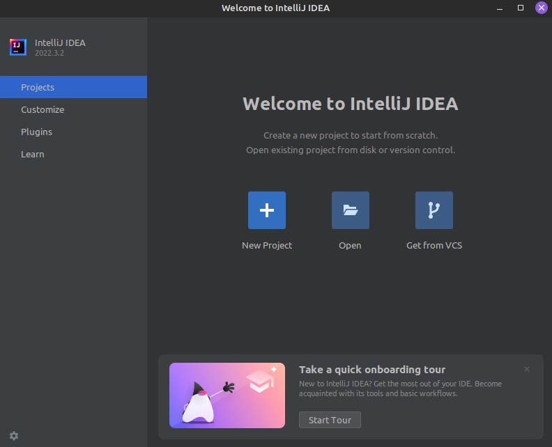
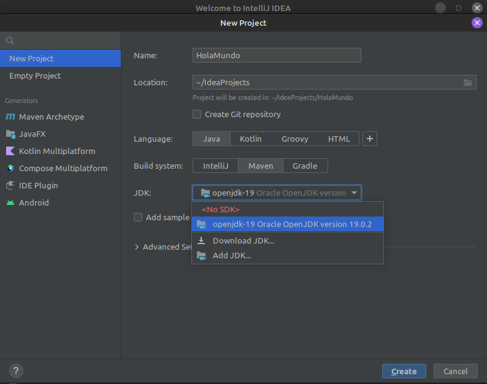
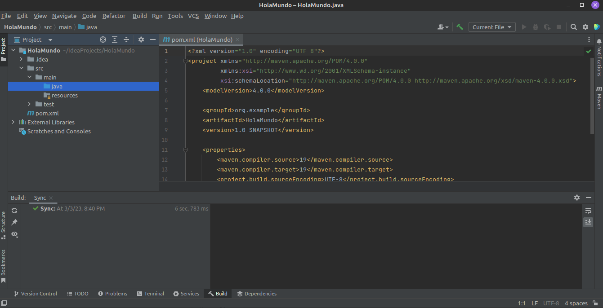

# Tutorial: Hola mundo en IntelliJ IDEA

1. Abrir IntelliJ IDEA
1. Crear un nuevo projecto

   

1. Elegir nombre, directorio y tipo de projecto (en nuestro caso vamos usar siempre y por comodidad, **Maven**).

   Seleccionar una versión de JDK (Java Developer Kit). De no tener una instalada, descargar la version más reciente con **Download JDK**. De tener una instalada, agregar su directorio con **Add JDK**.

   Destildar la opcion de agregar “sample code” (codigo de muestra).

   Finalmente, crear el proyecto haciendo click en **Create**.

   

1. Una vez inicializado el projecto, se deberia ver la siguiente estructura de carpetas. 

   

1. Para crear una clase de Java, hacer click derecho sobre la carpeta `java` y elegir la opcion `New -> Java Class`. Nombrarla `HolaMundo`.

   Esto genera una clase de Java vacía.

2. Escribir, dentro de la clase, las siguientes lineas de codigo

   ```java
   public static void main(String[] args) {
       System.out.println("Hola, mundo!");
   }
   ```

   Tambien se puede escribir “main” y utilizar el autocompletar del IDE.

3. Finalmente, para correr nuestro programa, clickear en el boton de “play” (⏵) de arriba a la derecha

   

   Se deberia visualizar, en la terminal integrada de IntelliJ, “Hola, mundo!”.

