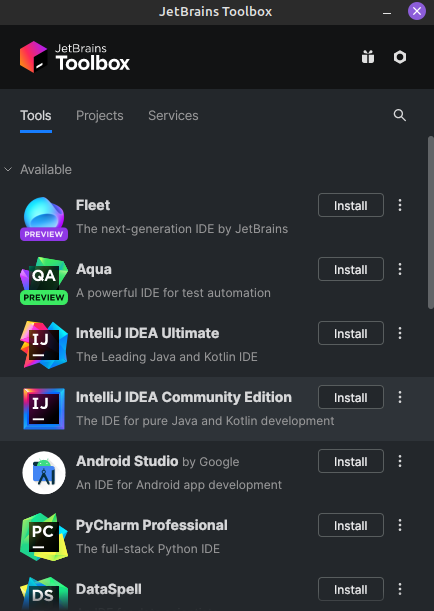

# Tutorial: instalación de IntelliJ IDEA

Para instalar IntelliJ Community Edition, seguir la [documentación oficial de
JetBrains](https://www.jetbrains.com/help/idea/installation-guide.html).
Recomendamos hacerlo mediante la Toolbox App.

