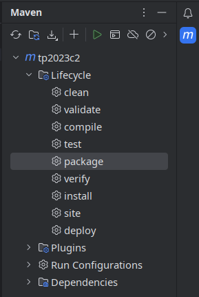
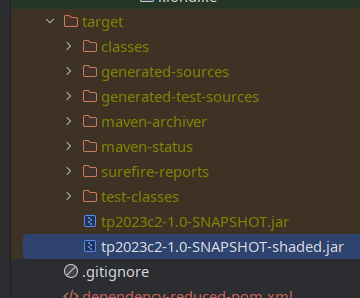

# Tutorial: Crear un JAR

{: .nota }
Este proceso NO es necesario para la entrega del TP.

Para poder compartir un programa hecho en Java de forma tal que pueda ser
ejecutado en otra computadora, los pasos en general son:

1. Compilar el proyecto y crear un archivo `.jar`.
2. Compartir el `.jar` a otra persona.
3. Esa persona debe:
    1. Tener instalado el Java Runtime Environment (JRE).
    2. Ejecutar en la consola `java -jar archivo.jar` (probablemente también
       funcione darle doble click al archivo).

## Pasos para crear el JAR

{: .nota }
Con este método es probable que el JAR funcione únicamente en el mismo
sistema operativo en el que fue creado (por ejemplo, si lo creaste en Windows,
solo se puede ejecutar en computadoras con Windows).

1. Agregar a la clase `Main` (la que extiende `Application`) una función `main`
   con:

    ```java
    public static void main(String[] args) {
        launch(args);
    }
    ```

2. Crear una clase nueva que **NO** extienda `Application` y que simplemente
   invoque a `Main.main()`:

    ```java
    public class ShadedMain {
        public static void main(String[] args) {
            Main.main(args);
        }
    }
    ```

3. Agregar en el `pom.xml` (entre `<plugins>` y `</plugins>`) y luego refrescar
   la configuración de Maven:

    ```xml
    <plugin>
        <groupId>org.apache.maven.plugins</groupId>
        <artifactId>maven-shade-plugin</artifactId>
        <version>3.5.1</version>
        <executions>
            <execution>
                <goals>
                    <goal>shade</goal>
                </goals>
                <configuration>
                    <shadedArtifactAttached>true</shadedArtifactAttached>
                    <transformers>
                        <transformer
                                implementation="org.apache.maven.plugins.shade.resource.ManifestResourceTransformer">
                            <mainClass>ShadedMain</mainClass>
                        </transformer>
                    </transformers>
                </configuration>
            </execution>
        </executions>
    </plugin>
    ```

4. Ejecutar el target `package` de Maven:

    

5. El JAR debería estar disponible en la carpeta `target`, con un nombre como
   `tp2023c2-1.0-SNAPSHOT-shaded.jar`.

    

    Se puede ejecutar en la consola con: `java -jar
    target/tp2023c2-1.0-SNAPSHOT-shaded.jar`

