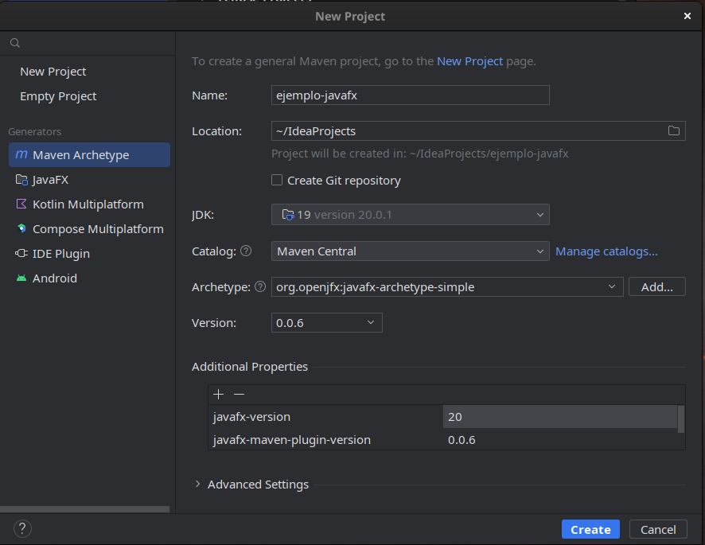
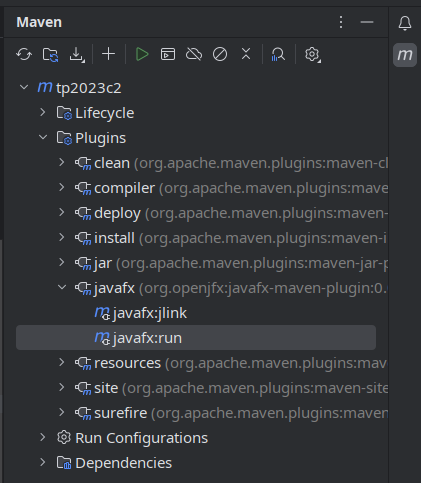
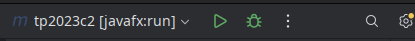

# Tutorial: JavaFX en IntelliJ IDEA

## Opción 1: Crear un proyecto desde cero

1. **New Project**

    - A la izquierda seleccionar **Maven archetype**
    - Catalog: **Maven Central**
    - Archetype: `org.openjfx:javafx-archetype-simple` (o
      `org.openjfx:javafx-archetype-fxml`).
    - `javafx-version`: `22` (o la última disponible, revisar en
      [https://gluonhq.com/products/javafx/](https://gluonhq.com/products/javafx/))
    - Click en **Create**

    

2. Notar que se creó el archivo `App.java` que contiene la función `main`.
   Observar el código que crea una ventana simple con un texto.

    ```java
    var label = new Label("Hello, JavaFX " + javafxVersion + ", running on Java " + javaVersion + ".");
    var scene = new Scene(new StackPane(label), 640, 480);
    stage.setScene(scene);
    stage.show();
    ```

3. **Ejecutar el programa.**

    Debería mostrarse la ventana con el texto.

## Opción 2: Agregar JavaFX a un proyecto existente

1. Agregar las dependencias correspondientes en Maven:

    [Uso de Maven](/entorno/maven)

    En el `pom.xml`: click derecho → **Generate** → **Dependency**

    En el cuadro de búsqueda ingresar `openjfx:javafx`.

    Seleccionar `javafx-controls` versión `22` (o la última disponible, revisar en
    [https://gluonhq.com/products/javafx/](https://gluonhq.com/products/javafx/)).
    Click en **Add**.

    Notar que en el `pom.xml` se agregó:

    ```xml
    <dependency>
        <groupId>org.openjfx</groupId>
        <artifactId>javafx-controls</artifactId>
        <version>22</version>
        <scope>compile</scope>
    </dependency>
    ```

    {: .nota }
    > Según sea necesario, se pueden agregar las dependencias opcionales:
    >
    > - `javafx-media` si se desea reproducir audio o video.
    > - `javafx-fxml` si se desea utilizar archivos FXML.

2. Click derecho en `pom.xml` → **Maven** → **Reload project**

3. Reemplazar la clase `Main` por una clase que extiende
   `javafx.application.Application`:

    ```java
    public class HolaMundo extends Application {
        @Override
        public void start(Stage stage) throws Exception {
            var label = new Label("Hola mundo!");
            var scene = new Scene(new StackPane(label), 640, 480);
            stage.setScene(scene);
            stage.show();
        }
    }
    ```

4. En el `pom.xml` agregar:

    ```xml
    <build>
        <plugins>
            <plugin>
                <groupId>org.openjfx</groupId>
                <artifactId>javafx-maven-plugin</artifactId>
                <version>0.0.8</version>
                <configuration>
                    <mainClass>HolaMundo</mainClass>
                </configuration>
            </plugin>
        </plugins>
    </build>
    ```

    Notar que en la línea `<mainClass>` el nombre de la clase debe coincidir
    con la clase creada en el punto anterior.

5. Para ejecutar el programa:

    Abrir la pestaña **Maven**

    Doble click en **Plugins → javafx →**  `javafx:run`

    

    {: .nota }
    > En la esquina superior derecha de la pantalla se puede
    > seleccionar `javafx:run`  para que se ejecute por defecto esta opción al
    > presionar el botón “play” (⏵).
    >
    > 

