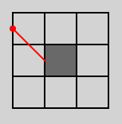
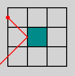
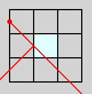
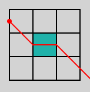

# TP1: Lasers

El objetivo de este trabajo práctico es implementar un videojuego.

Se aplicarán conceptos de:

- Programación orientada a objetos
- Interfaces gráficas

El TP se desarrolla en forma **grupal**, en grupos de 2 integrantes.

## Reglas de juego

<video controls src="./lasers.webm" type="video/webm"></video>

* Lasers es un juego de estilo _puzzle_, que se desarrolla por turnos hasta que
  el jugador encuentra la solución del problema.
* En cualquier momentom el usuario puede elegir un nivel cualquiera de una
  lista de niveles disponibles.
* El juego se desarrolla en una grilla bidimensional.
* Según la configuración de cada nivel, en la grilla se disponen los siguientes
  elementos:
    * Emisor laser: Puede ubicarse únicamente en el borde entre dos celdas, o
      en el borde de la grilla (es decir, nunca en una esquina o en el centro
      de una celda). El rayo se emite en una de 4 direcciones diagonales
      posibles.
    * Objetivo: Puede ubicarse únicamente en el borde entre dos celdas, o
      en el borde de la grilla.
    * Piso: Ocupa una celda. Permite que la celda contenga un Bloque.
    * Bloque: Solo puede ubicarse sobre una celda que contiene un Piso.
      Hay bloques de diferentes tipos:
        * Bloque opaco fijo: Absorbe rayos laser. No se puede mover.

          

        * Bloque opaco móvil: Absorbe rayos laser.

          

        * Bloque espejo: Refleja los rayos laser.

          

        * Bloque de vidrio: Al ser alcanzado por un rayo, el rayo se difracta
          en 2. Un rayo es reflejado (al igual que el bloque espejo), y el otro
          continúa con la misma dirección (como si no hubiera ningún bloque).

          

        * Bloque de cristal: Al ser alcanzado por un rayo, el rayo se refracta,
          continuando en línea recta y saliendo por el extremo opuesto del
          bloque, con la misma dirección de origen.

          

* En cada turno, el jugador puede mover un Bloque (que no sea fijo) a cualquier
  celda que esté libre (y que tenga un Piso).
* El nivel es completado cuando todos los Objetivos son alcanzados por al menos
  un rayo laser.

## Niveles

Se dispone de archivos de configuración de 6 niveles para descargar:

<a href="./levels.zip" class="btn btn-default btn-lg">levels.zip</a>

Se debe implementar al menos estos 6 niveles en el juego. Estos archivos deben
estar ubicados en la carpeta `resources`, y el programa debe inicializar cada
nivel en base a su configuración, en tiempo de ejecución.

Un ejemplo de un archivo de nivel es:

```
 .R.
....
.R.R
..F.
....
.R..

E 0 1 SE
G 8 9
```

El archivo está separado en 2 secciones, y las secciones están separadas por
una línea en blanco.

* Primera sección: configuración de bloques.
    * <code class="language-plaintext highlighter-rouge">&nbsp;</code> (espacio) celda sin piso
    * `.` celda con piso vacía
    * `F` bloque opaco fijo
    * `B` bloque opaco móvil
    * `R` bloque espejo
    * `G` bloque vidrio
    * `C` bloque cristal
* Segunda sección: configuración de emisores y objetivos
    * `E <columna> <fila> <direccion>` emisor laser, donde `direccion` puede
      ser:
      * `SE` sur-este
      * `SW` sur-oeste
      * `NE` nor-este
      * `NW` nor-oeste
    * `G <columna> <fila>` objetivo

Notar que los emisores y objetivos siempre tendrán una coordenada par y otra impar.
Este sistema de coordenadas asume que cada celda ocupa 2x2 y su centro está en
una coordenada (impar, impar). En el ejemplo, el centro de la celda de arriba a
la izquierda está en (1, 1) y el de la celda de abajo a la derecha está en (7,
11).

## Interfaz gráfica

* Se debe implementar una interfaz gráfica para el juego, con JavaFX.
    - Ver [JavaFX en IntelliJ IDEA](/entorno/tutorial-javafx/)
* Debe ser posible jugar con el mouse, arrastrando los bloques (_drag & drop_).
* Al completar un nivel se debe mostrar una indicación y no se debe permitir
  mover ningún bloque hasta que el jugador elige otro nivel.
* No se evalúa el diseño gráfico.

## Requerimientos adicionales

* El proyecto debe utilizar Maven.
    - Ver [Uso de Maven](/entorno/maven/)

* Deben estar bien separadas las clases relacionadas con la **lógica** y la
  **interfaz gráfica**, en 2 capas de abstracción.

* Se debe utilizar **polimorfismo** para implementar los comportamientos de los
  disferentes bloques.

* Agregar un **diagrama de clases** y/o **secuencia** en formato `png` o `pdf`.
  El diagrama debe incluir las clases principales de la capa **lógica**.

* **Opcionalmente**, acompañar el diagrama con un **informe** explicando y
  justificando las decisiones de diseño tomadas.

    {: .nota }
    Por convención, el código fuente se ubica dentro de la carpeta `src/main/java`
    (automáticamente creada por IntelliJ), y la documentación en la carpeta `doc`
    (que debe ser creada a mano).

## Entrega

**Fecha de entrega:** 7 de octubre 2024

**Fecha límite para aprobar:** 28 de octubre 2024

* El código debe estar alojado en un repositorio **privado** de Github.
    - Ver [Uso de Git y Github](/entorno/git-y-github/)
    - Agregar al repositorio un archivo `README.md` con el nombre y padrón de los integrantes del grupo.
    - Dar acceso al usuario `dessaya`.
