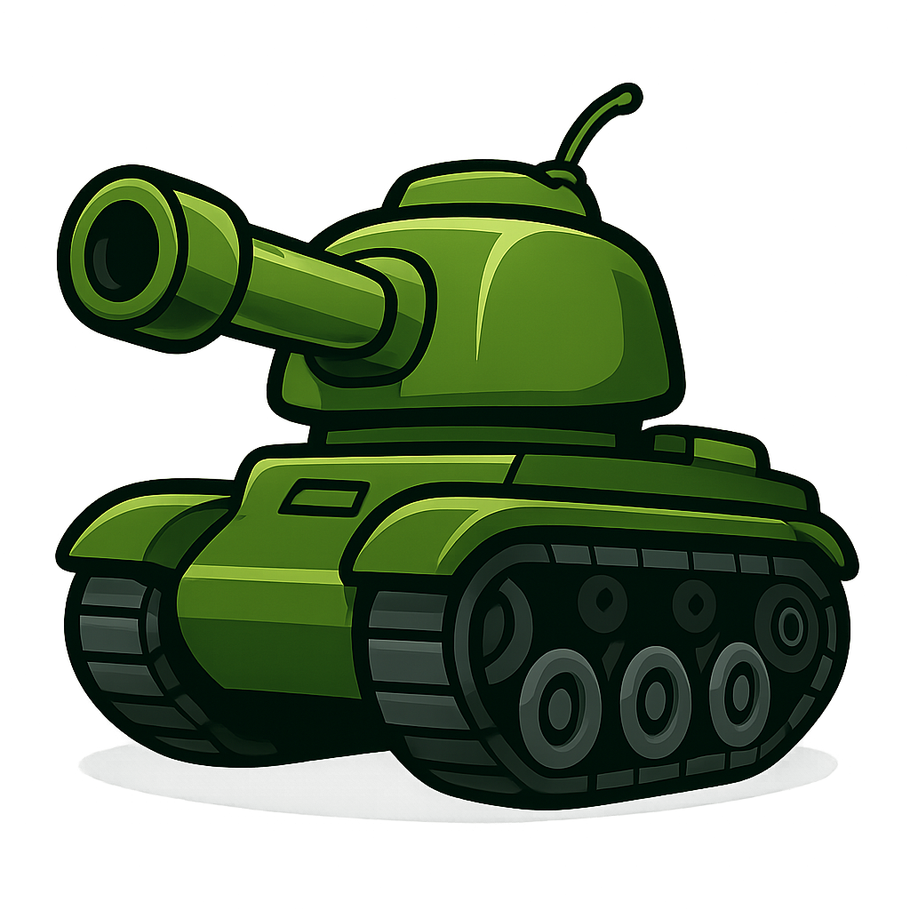
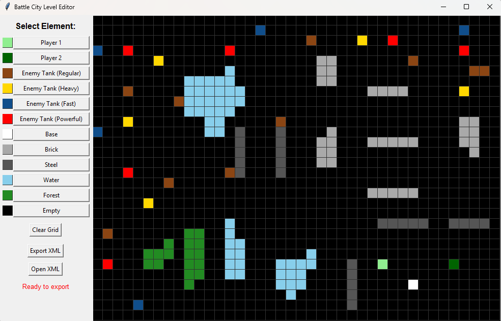

# TP1: YABC - Yet Another Battle City
{: .no_toc }

**Paradigmas de Programación - FIUBA**  
**Enunciado de Trabajo Práctico 1**

1. Índice
{:toc}

## Objetivo

Implementar una versión propia del tradicional juego **Battle City**.

## Referencias del Juego Original

- 🎮 [Demo jugable online](https://www.retrogames.cz/play_014-NES.php)
- 📚 [Información general en Wikipedia](https://en.wikipedia.org/wiki/Battle_City)

## Aplicación de temas y conceptos

- Programación Orientada a Objetos  
- Principios de Programación  
- Interfaces Gráficas

## Contexto del Proyecto (Hipótesis)

Según las mejores prácticas, se desea separar el código en al menos dos capas de abstracción:

- **Vista o Presentación**: renderizado, efectos de sonido, eventos de teclado del usuario  
- **Modelo**: tanques, niveles, lógica del juego

> 💡 *A futuro*, se contempla el uso de un motor 3D. Por lo tanto, **las clases del Modelo no deben tener ninguna dependencia** de clases de la Vista ni de JavaFX.

## Reglas del Juego

### 🎯 Objetivo principal

El jugador controla un tanque cuyo objetivo es defender la base (representada por un águila) ubicada en algún lugar del mapa, mientras destruye todos los tanques enemigos que aparecen en cada nivel.

- Se pasa un nivel derrotando a todos los enemigos presentes al inicio y los que aparezcan por *spawning*.
- El juego termina en **victoria** si se completan los 3 niveles.
- El juego termina en **derrota** si:
  - La base es destruida (con un solo disparo).
  - Todos los jugadores pierden todas sus vidas.

### 👥 Jugabilidad

- El juego puede ser individual o cooperativo (dos jugadores simultáneos): *jugador 1* y *jugador 2*.
- Cada jugador controla un tanque con movimiento en cuatro direcciones: arriba, abajo, izquierda, derecha.
- Los tanques disparan proyectiles en línea recta. Solo se permite **un disparo activo por jugador** hasta que impacte o desaparezca.
- Si un jugador pierde todas sus vidas, el otro continúa jugando.
- Cada jugador inicia cada nivel con **3 vidas** (resiste 3 impactos).
- Los puntos de vida se miden en **impactos de bala**.
- Si un disparo colisiona con otro disparo, ambos se destruyen.

### 🧱 Entorno

El mapa está compuesto por distintos tipos de bloques:

- **Ladrillos**: destructibles por disparos (3 impactos).
- **Acero**: indestructibles.
- **Agua**: impide el paso pero no bloquea disparos.
- **Bosque**: oculta visualmente los tanques pero no afecta movimiento ni disparos.

La base puede estar rodeada por ladrillos, que pueden ser destruidos por enemigos o por error del jugador. Esto depende del diseño de cada nivel.

**Escenario de referencia**:

- Tamaño: `800x600` píxeles
- Grilla: `40x30` celdas de `20x20` píxeles
- Bloques estáticos se ajustan a la grilla
- Tanques se mueven de forma **continua**, no por bloques
- Movimiento redondeado a la unidad de píxel por frame
- Colisiones evaluadas en píxeles
- Disparos: tamaño `6x6` píxeles

> Se podrán ajustar escalas y tamaños gráficos según convenga, manteniendo coherencia entre píxeles y unidades lógicas del juego.

### 🚨 Enemigos

- Están precargados para cada nivel.
- Se pueden generar enemigos adicionales por *spawning* desde la parte superior del mapa.
- Límite de *spawning*: **máximo 10 tanques durante no más de 1 minuto**.

> 🛠️ *Este límite se establece para facilitar la corrección del trabajo práctico, permitiendo observar el comportamiento de los enemigos en un intervalo controlado.*

Tipos de enemigos:

| Tipo       | Color      | Características                      |
|------------|------------|--------------------------------------|
| Básico     | Marrón     | Lento y débil                        |
| Rápido     | Azul       | Se mueve velozmente                  |
| Potente    | Rojo       | Dispara más rápido (1 disparo/seg)   |
| Blindado   | Anaranjado | Requiere 3 disparos para destruirse  |

### 🤖 Inteligencia Artificial

Los enemigos usan una **máquina de estados simple**:

- En estado normal, avanzan y disparan si tienen disparo disponible.
- Se sortea un número entre `1` y `5` segundos como *tiempo de conducta*.
- Al finalizar ese tiempo, el enemigo:
  - Sortea una nueva dirección (↑ ↓ ← →)
  - Comienza a moverse hacia allí
  - Sortea un nuevo tiempo de conducta
- Si permanece más de `2` segundos en el mismo lugar, sortea una nueva dirección.
- Todos los enemigos comparten esta lógica de comportamiento.

## 💥 Power-ups

Al destruir enemigos se sortea la aparición de un power-up aleatorio en el mapa.

- Probabilidad de aparición: **20%** por enemigo destruido (un powerup por vez)
- Todos los tipos de powerup tienen igual probabilidad entre sí de aparecer
- Ubicación: totalmente aleatoria, no alineada con la grilla
- Tamaño: igual al de un bloque estático o tanque
- Activación: se consumen al ser “pisados” por el jugador
- Efecto: se aplica inmediatamente y el power-up desaparece
- **Solo los jugadores** pueden consumir power-ups.

### Power-ups obligatorios

| Power-up | Efecto |
|----------|--------|
| **Granada** | Destruye todos los enemigos en pantalla (si no hay spawnings pendientes, se gana el nivel) |
| **Casco** | Otorga invulnerabilidad temporal por 10 segundos ante disparos (ver animaciones de tanque) |
| **Estrella** | Mejora el disparo del jugador (mata cualquier tanque con un solo disparo) |

### Power-up extra (no evaluable)

| Power-up | Efecto |
|----------|--------|
| **Pala** | Refuerza la base con bloques de acero. Se evita colocar acero sobre tanques cercanos |

---

## ⚠️ Interacciones especiales

- Si un jugador dispara accidentalmente a otro, este queda **congelado momentáneamente** (no puede moverse, pero sí disparar).
- Si un jugador destruye la base por error, el juego **termina inmediatamente**.

---

## 🎨 Gráficos

Se proveen sprites hechos a mano para su uso en el juego.  
- Tamaño estándar: **20x20 píxeles**
- Uso: opcional, pueden modificarse, redimensionarse o reemplazarse

### Sprites disponibles

| Elemento | Archivo PNG |
|----------|-------------|
| Base de jugadores | `base20x20.png` |
| Bloque de ladrillos (destructible) | `BrickBlock20x20.png` |
| Tanque enemigo rápido 1 | `EnemyTankFast0_20x20.png` |
| Tanque enemigo rápido 2 | `EnemyTankFast1_20x20.png` |
| Tanque enemigo blindado 1 | `EnemyTankHeavy0_20x20.png` |
| Tanque enemigo blindado 2 | `EnemyTankHeavy1_20x20.png` |
| Tanque enemigo potente 1 | `EnemyTankPowerful0_20x20.png` |
| Tanque enemigo potente 2 | `EnemyTankPowerful1_20x20.png` |
| Tanque enemigo básico 1 | `EnemyTankRegular0_20x20.png` |
| Tanque enemigo básico 2 | `EnemyTankRegular1_20x20.png` |
| Celda de bosque (tanques y disparos pasan por debajo) | `Forest20x20.png` |
| Escudo de invulnerabilidad (power-up) | `InvulnerableRing20x20.png` |
| Imagen de pantalla de inicio | `logo.png` |
| Tanque Jugador 1, sprite 1 | `Player1Tank0_20x20.png` |
| Tanque Jugador 1, sprite 2 | `Player1Tank1_20x20.png` |
| Tanque Jugador 2, sprite 1 | `Player2Tank0_20x20.png` |
| Tanque Jugador 2, sprite 2 | `Player2Tank1_20x20.png` |
| Power-up Granada | `PowerUp-Grenade20x20.png` |
| Power-up Casco | `PowerUp-Helmet20x20.png` |
| Power-up Pala | `PowerUp-Shovel20x20.png` |
| Power-up Estrella | `PowerUp-Star20x20.png` |
| Disparo | `Shot.png` |
| Bloque de acero (indestructible) | `SteelBlock20x20.png` |
| Tanque destruido (intransitable) | `TankDestroyed_20x20.png` |
| Bloque de agua (intransitable, permite disparos) | `Water20x20.png` |
| Sprite vacío (template, no se usa en el juego) | `WhiteBlock20x20.png` |

## 🎞️ Animación de Tanques

- Cada tanque debe tener una **animación de al menos 2 sprites** durante el movimiento.
- El set provisto incluye 2 sprites por tipo de tanque, alternando el rayado de las orugas para simular movimiento.
- Si se reemplaza el set provisto, se deberá mantener la animación alternando sprites.
- En reposo, el tanque conserva el **último sprite utilizado**.
- Al iniciar el nivel, cada tanque debe tener un **sprite predeterminado**.
- Cuando un tanque es destruido:
  - Se reemplaza por el sprite de tanque destruido
  - El lugar queda **intransitable** hasta finalizar el nivel
- Al tomar un jugador el power-up de indestructibilidad, se dibuja el sprite semitransparente `InvulnerableRing20x20.png` sobre su tanque.

---

## 🔇 Sonidos

El juego debe incluir:

- 🎵 Música de fondo en bucle
- 🔊 Efectos de sonido para eventos clave

Los sonidos provistos fueron descargados de [pixabay.com](https://pixabay.com) y son de uso libre. Se pueden editar o reemplazar, respetando derechos de autor si se usan fuentes externas.

### Efectos requeridos

| Evento | Archivo de sonido |
|--------|-------------------|
| Música de juego (bucle infinito) | `tribe-drum-loop-103173.mp3` |
| Disparo (jugador o enemigo) | `laser-gun-280344.mp3` *(recortado)* |
| Muerte de tanque | `bang-43964.mp3` |
| Destrucción de base (derrota) | `explosion-42132.mp3` |
| Impacto en tanque blindado (sin destruir) | `glass-cling-08-83792.mp3` |
| Impacto en bloque de acero (sin destruir) | `glass-cling-08-83792.mp3` |
| Destrucción de bloque de ladrillos | `wood-impact-84721.mp3` |

> 🎧 *Los archivos son sugeridos. Se pueden modificar o reemplazar, siempre respetando licencias de uso libre o no comercial.*

## 📋 Requerimientos Funcionales

### Implementación de Reglas de Juego

Todas las reglas del juego deben ser implementadas para aprobar el trabajo práctico.  
Las siguientes características son **opcionales**, pero se tendrán en cuenta para alcanzar las notas más altas:

- Juego cooperativo: dos jugadores simultáneos
- Implementación de todos los power-ups
- Interacción especial: congelar al otro jugador al dispararle
- Efectos de sonido según tabla provista (se aceptan sonidos alternativos)
- Spawning de enemigos

> 🎓 *La nota final también dependerá de la calidad del código entregado. Si los extras presentan fallas, el corrector decidirá si se consideran cumplidos.*

---

### 🖥️ Pantalla de Inicio

El juego debe iniciar con una pantalla de bienvenida que incluya:

- Imagen `logo.png` (o una alternativa elegida por el grupo)
- Uso del mismo logo como ícono de la aplicación
- Tres botones funcionales:
  - **Iniciar 1 Jugador**
  - **Iniciar 2 Jugadores**
  - **Salir**

---

### 🔄 Flujo de Aplicación

- Desde la pantalla de inicio, se inicia el primer nivel según la selección del usuario.
- El juego continúa mientras **al menos un jugador esté vivo**.
- Si ambos jugadores son eliminados:
  - Se muestra un cartel de derrota
  - Se regresa a la pantalla de inicio
- Controles (movimiento + DISPARO):
  - Jugador 1: `W-A-S-D` + ESPACIO
  - Jugador 2: flechas del teclado + ENTER
- Al eliminar todos los enemigos de un nivel:
  - Se pasa al siguiente nivel
- El juego consta de **3 niveles distintos**
- Al completar el tercer nivel:
  - Se muestra un cartel de victoria (puede incluir imagen alegórica)
  - Se regresa a la pantalla de inicio

---

### 🗂️ Carga de Niveles

Los niveles se definirán en formato **XML**, permitiendo especificar:

- Posición inicial de tanques enemigos
- Tipo de cada enemigo
- Posición inicial de los jugadores (Player 1 y Player 2)
- Posición de la base a defender
- Ubicación de bloques especiales: ladrillo, acero, agua, bosque

**Convenciones de posicionamiento**:

- Objetos estáticos: ubicados en celdas contiguas de tamaño fijo
- Tanques: posicionamiento inicial ajustado a la grilla, luego movimiento continuo

**Validación y estructura**:

- Se provee un formato XML propuesto y un editor de escenarios (opcional, en Python)
- El grupo puede definir su propio formato XML
- El archivo XML debe ser validado mediante un archivo **XSD**
- La clase que carga el nivel desde XML debe ser **independiente** de la clase que representa el nivel

> 🧪 *El juego debe incluir al menos 3 niveles jugables distintos.*

---

### ❌ Cierre de Aplicación

- El usuario puede salir desde el botón **Salir** en el menú de inicio
- También puede cerrar la ventana de la aplicación en cualquier momento

## ⚙️ Requerimientos No Funcionales

### Lenguaje y Herramientas

- Lenguaje: **Java** (preferentemente versión 24)
- Gestor de dependencias: **Maven** (`pom.xml`)
- Interfaz gráfica: **JavaFX**
- Repositorio: **Git y GitHub**, alojado en GitHub Classroom
- Carga de niveles: **Parser XML**

> 🔒 *IMPORTANTE*: El contenido del proyecto es **privado** mientras al menos un grupo tenga el TP en curso.  
> Compartir código será motivo de **descalificación inmediata** para todos los involucrados.

---

### Idiomas

- Interfaz de usuario: **Español o Inglés**
- Documentación: **Español**

---

### Arquitectura

- Separación en capas: **Modelo (Lógica)** y **Vista (Presentación)**
- Opcional: implementación del patrón **MVC (Model-View-Controller)**
- Restricciones:
  - Las clases del modelo **no deben referenciar** clases de vista ni de JavaFX
  - Si se usa MVC, el modelo **tampoco debe depender** del controlador

---

### Diseño de Clases

- Uso obligatorio de **polimorfismo** en al menos un aspecto del diseño
- Se deben respetar los **principios de diseño** vistos en clase
- Si se decide no respetar algún principio, debe justificarse adecuadamente

---

### Interfaz

- La ventana de juego debe tener **tamaño fijo**
- No debe ser **redimensionable** por el usuario

---

## 📄 Documentación Escrita

Debe incluir:

- Diagrama de clases **UML** del modelo
- Archivo `readme.md` en formato Markdown con:
  - Universidad, Facultad y Materia
  - Docentes y docente corrector
  - Nombre y apellido de los alumnos
  - Nombre del grupo
  - Nombre del proyecto
  - Descripción breve del proyecto
  - Instrucciones para ejecución
  - Instrucciones de juego (comandos)

---

## 🎥 Documentación Audiovisual

Cada integrante debe presentar un video individual que cumpla con:

- Duración: **5 a 10 minutos**
- Debe verse la **cara del expositor**
- Mostrar el juego funcionando (máximo 1 minuto)
- Explicar:
  - Diseño de clases
  - Uso de polimorfismo
  - Principios de diseño respetados y no respetados

---

## 🧪 Pruebas y Optimización

- No se requiere optimización avanzada de física o renderizado
- Pruebas automáticas: **opcionales**, solo para clases del modelo
  - Se sugiere:
    - Al menos **1 test de integración**
    - Tests unitarios de **3 clases distintas**

---

## 🚀 Entrega y Gestión de Repositorio

La entrega se realiza mediante **GitHub Classroom**, en equipos de **2 integrantes**.

### Pasos para vinculación:

1. Acceder al enlace: [GitHub Classroom TP1](https://classroom.github.com/a/Sn8wv7lZ)
2. Un integrante:
   - Crea un grupo (máximo 2 personas)
   - Asigna un nombre identificable y académico
3. El segundo integrante:
   - Ingresa al mismo enlace
   - Se une al grupo creado

### Repositorio

- GitHub genera automáticamente el repositorio compartido
- Entrega oficial: mediante **Issue o Pull Request**
  - Indicar rama de entrega
  - Estado del proyecto
  - Condiciones de ejecución
- Se recomienda clonar el repositorio en limpio para verificar funcionamiento
- Al aprobarse, los cambios deben integrarse a la **rama principal**

> 📌 *El archivo `readme.md` debe ser el primer archivo incluido en el repositorio.*

### Observaciones

- Cada equipo debe tener **un único repositorio compartido**
- La entrega será válida **solo si ambos integrantes están correctamente vinculados**
- No crear el repositorio manualmente; se genera al aceptar la invitación
- Ante dudas o problemas técnicos, contactar al equipo docente con anticipación

---

## Material Provisto

<a href="./YABC-Assets.zip" class="btn btn-default btn-lg">YABC-Assets.zip</a>

Se provee material auxiliar de uso opcional (se pueden reemplazar elementos, pero no pueden faltar funcionalidades relacionadas):
- Editor de niveles en formato XML estandarizado
- Archivo XSD para validación de archivos de nivel en formato XML
- Sonidos, según tabla de eventos
- Sprites, según tabla de imágenes y animaciones

---

## 🧭 Trabajo de Referencia

Se incluye un ejemplo para ilustrar la **separación en capas** y el uso de **Canvas en JavaFX** para renderizar en tiempo real.

- Juego: implementación de **Pong** para dos jugadores
- Controles por teclado
- Descargable y ejecutable

🔗 [Repositorio de referencia - Pong](https://github.com/algoritmos3ce/pong)

## ✅ Criterios de Corrección

### Principios de Programación evaluados

El código será analizado en función de los siguientes principios:

- **Tell, Don’t Ask**
- **Principle of Least Astonishment**
- **Principle of Least Knowledge**
- **Don't Repeat Yourself (DRY)**
- **YAGNI (You Ain't Gonna Need It)**
- **Keep It Simple, Stupid (KISS)**
- **Explicit Dependencies Principle**
- **Knuth's Optimization Principle**
- **Separation of Concerns**
- **Principios SOLID**

> 🎯 Se busca lograr **bajo acoplamiento** y **alta cohesión** en el diseño de clases.

---

### Aspectos específicos a evaluar

- Jugabilidad con teclado
- Reinicio del juego sin salir de la aplicación
- Corrección del diagrama de clases
- Video individual por integrante, con exposición clara de decisiones de diseño
- Elegancia y legibilidad del código
- Uso correcto del paradigma de **Programación Orientada a Objetos**
- Aplicación de **polimorfismo** y diseño de clases según principios vistos
- Separación adecuada entre **vista** y **lógica**
- Ausencia de dependencias del modelo hacia la vista o clases de JavaFX
- Las contribuciones de todos los integrantes del grupo al proyecto deben ser significativas

---

### Prácticas prohibidas

- Uso de **variables globales** o `static` (excepto `static final` para constantes)
- Clases o métodos excesivamente largos (código spaghetti)
- Uso de `instanceof` u otras formas de verificación de tipo que violen OCP o TDA

---

## 📝 Entrega y Nota

- La entrega debe realizarse dentro del plazo indicado como **"fecha límite de entrega"** en el calendario de la materia.
- Si no se cumple con esta fecha, el trabajo será considerado **desaprobado** y no se aceptarán entregas posteriores.

### Evaluación

- Una vez recibido el trabajo, el corrector decidirá si está **aprobado o no**.
- Si se aprueba, se asignará una **nota entre 4 y 10**.
- Se contempla **una única instancia de reentrega**, dentro del plazo de la **"fecha límite de aprobación"**, tanto si el trabajo fue aprobado como si no.

> 📌 *Es responsabilidad del grupo cumplir con los plazos y condiciones establecidos por la cátedra.*

