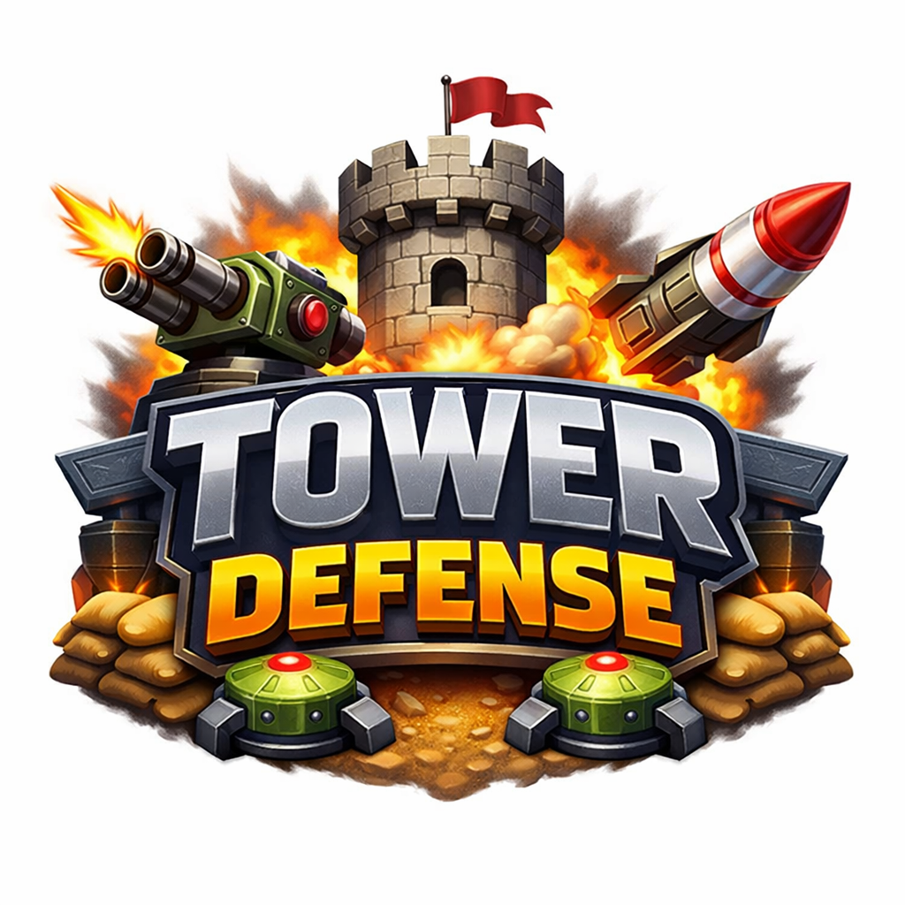

# TP1: Tower Defense Simplificado
{: .no_toc }

**Paradigmas de Programación - FIUBA**  
**Enunciado de Trabajo Práctico 1**

1. Índice
{:toc}

---

## Objetivo

Implementar una versión propia del tradicional género **Tower Defense**, aplicando conceptos de **Programación Orientada a Objetos (POO)** y principios de buen diseño de software.

---

## Referencias

- 📖 [Tower Defense en Wikipedia](https://en.wikipedia.org/wiki/Tower_defense)

---

## Aplicación de temas y conceptos

- Programación Orientada a Objetos  
- Principios de diseño (bajo acoplamiento, alta cohesión, DRY, KISS, SOLID, etc.)  
- Interfaces gráficas con **JavaFX**  
- Gestión de dependencias con **Maven**

---

## Contexto del Proyecto

El juego debe estar dividido en al menos dos capas de abstracción:

- **Modelo**: enemigos, torretas, lógica de juego, niveles.  
- **Vista/Presentación**: renderizado gráfico, sonidos, interacción con el usuario.  

Las clases del modelo **no deben depender** de JavaFX ni de clases de la vista.

---

## Reglas del Juego

### Escenario

- Resolución fija de referencia: **800x600 píxeles**.  
- El escenario incluye:
  - Una **base enemiga** (spawning de enemigos).  
  - Una **ruta fija** que los enemigos siguen en orden.  
  - Una **base del jugador**, objetivo a defender.  
  - **Slots predefinidos** para colocar torretas.  

### Enemigos

- 3 tipos de enemigos:
  - Sprite distintivo.  
  - Puntos de vida diferentes.  
  - Recompensa en dinero y puntaje al ser destruidos.  
  - Nivel de daño distinto al llegar a la base (se inmolan al llegar).
  - Enemigo aéreo: emprende un recorrido recto hacia base, ignorando la ruta fija, y su sprite se renderiza siempre por encima de los demás.
- Colisiones con proyectiles se evalúan a nivel de sprite por bounding box global (ancho por alto).

### Torretas

- Al menos **3 tipos de torretas**:
  - Una **torreta simple**: dispara al primer enemigo del recorrido que respeta su rango de alcance.
  - Una **torreta rápida**: tiene el doble de cadencia de disparos e igual daño por disparo que la torreta simple.
  - Una **torreta potente**: sus disparos son de un color diferente al de las torretas anteriores e inflijen el doble de daño.
  - Una **torreta distante**: tiene el doble de alcance que las demás torretas y funciona como una torreta simple. Esta torreta será opcional y para mejorar la nota.
- Cada tipo tiene:
  - Costo distinto.  
  - Tasa de disparos (medible en disparos por minuto o un disparo cada tantos milisegunods).
  - Daño por disparo
  - Un rango de alcance de sus disparos
- Los proyectiles:
  - Se disparan hacia un enemigo específico.
  - Tienen una cantidad de daño asociada y que se aplica al enemigo impactado.
  - Actualizan su dirección en cada frame, avanzando hasta impactar o hasta que el enemigo desaparezca o hasta que el proyectil salga del área de juego (que en este caso coincide con la pantalla).  
- Las torretas son autónomas, disparan al enemigo más cercano dentro de su radio de alcance.
- Una vez colocadas, se pueden reemplazar por otra torreta comprando la nueva como si el slot ocupado estuviera vacío.

### Dinámica de juego

- El jugador inicia cada nivel con una cantidad fija de dinero.
- El nivel puede traer algunas torretas preinstaladas en algunos slots (no deben ser suficientes para pasar el nivel).  
- El jugador puede instalar torretas en slots predeterminados seleccionando el tipo desde la barra superior.
- Al instalarse una torreta, se deduce el costo del dinero disponible del jugador. En caso de no ser suficiente el dinero, no se podrá instalar la torreta.
- El nivel termina cuando:
  - Se destruyen todos los enemigos (victoria de nivel).  
  - La base del jugador es destruida (derrota).
  - El jugador interrupe el juego (cerrando la aplicación).
- El juego consta de **3 niveles**.  
- Al ganar el último nivel se muestra un cartel de felicitaciones (victoria definitiva). Al cerrarse el cartel se volverá al menú de inicio.

---

## Carga de Niveles

- Los niveles deben definirse en **archivos XML**, usando cualquiera de los [tres parsers disponibles](https://www.javacodegeeks.com/2013/05/parsing-xml-using-dom-sax-and-stax-parser-in-java.html) en la biblioteca estándar de Java.
- Cada archivo incluye:
  - Lista de enemigos y tiempo de aparición o delay de los enemigos.
    - Se especifica para cada enemigo en la lista el tipo de enemigo y el tiempo de aparición o diferencial de tiempo entre la aparicion de un enemigo a otro (delay)
    - Se podrán agregar enemigos en cualquier orden de aparición en el archivo para que el juego los levante y haga aparecer cada uno a su tiempo.
  - Posición de base enemiga, ruta y base del jugador.
    - Se debe especificar la ruta que deben seguir los enemigos  
    - La ruta inicia siempre en la base enemiga (spawning point) y termina en la base del jugador.
  - Slots disponibles para torretas, torretas iniciales, si las hubiera, y dinero inicial.
- El formato puede ser definido por cada grupo, pero debe validarse al cargar, tanto en formato, mediante el parser, como semánticamente, mediante un archivo XSD a definir propio (tipos de dato, etc.). Se puede usar IA para generar el XSD en base al formato XML que defina el equipo y validarlo con la API de javax.xml.validation.
- En caso de formato inválido, el programa debe mostrar un mensaje de error informativo al usuario y finalizar la ejecución.

---

## Interfaz

- Menú de inicio con:
  - Imagen de bienvenida
  - **Iniciar juego** (primer nivel).  
  - **Salir**.
- Pantalla de niveles de juego con:
  - Barra superior o inferior en niveles de juego con:
    - Dinero disponible.  
    - Puntaje acumulado.  
    - Íconos de las 3 torretas para su selección y posterior instalación en el escenario.
  - Escenario donde se instalarán y dibujarán los enemigos, las torretas, los disparos y las bases enemiga y propia.
- Flujo:
  - Al ganar un nivel → cartel de victoria → siguiente nivel.  
  - Al perder un nivel → cartel de derrota → volver al menú.  

---

##  Gráficos y Sonidos

- Cada grupo debe obtener o generar sus propios **sprites y sonidos**.  
- Se recomienda mantener coherencia visual y sonora.  
- No infringir derechos de autor de material de uso restringido. Mencionar licencias de uso en archivo README del TP y acreditar autores de material ajeno citando las fuentes cuando corresponda según licencia de uso.
- Los sonidos deben ser música de fondo en bucle y efectos para los siguientes eventos clave del juego:
  - aparición de enemigo
  - muerte de enemigo
  - instalación de torreta
  - victoria de nivel
  - derrota de nivel
  - victoria definitiva

### Sitios recomendados

- **[OpenGameArt.org](https://opengameart.org/)**  
  Repositorio comunitario de sprites, tilesets, íconos y efectos visuales para videojuegos. Todo el material está bajo licencias libres (Creative Commons, GPL, etc.), ideal para proyectos académicos.

- **[Freesound.org](https://freesound.org/)**  
  Biblioteca colaborativa de efectos de sonido y música, con licencias abiertas. Permite descargar y reutilizar sonidos siempre que se respeten las condiciones de atribución.

- **[Pixabay](https://pixabay.com/sound-effects/)**  
  Además de imágenes, ofrece música y efectos de sonido libres de derechos, aptos para uso no comercial y académico.

### Assets provistos por la catedra (Opcionales)
Se proveen assets de referencia que **no son de uso obligatorio**. Alternativamente pueden generar y usar sus propios assets u obtener otros de terceros, respetando las debidas licencias de uso. Estos assets fueron confeccionados en base a este trabajo de licencia de uso libre: [assets_de_base](https://zintoki.itch.io/ground-shaker).

**[assets.zip](./assets.zip)**

Se aclara además que se pueden usar assets esquemáticos que no requieran por ejemplo rotación de la imagen. Las animaciones y el uso de sprites más avanzado podrán ser tenidos en cuenta para la evaluación del trabajo globalmente, aunque no es el foco de la materia el criterio artístico ni estético.

---

### Observación

Se debe verificar siempre la **licencia específica** de cada recurso descargado, ya que algunos requieren atribución explícita al autor. El uso de material con licencias abiertas es obligatorio para evitar problemas legales o de derechos de autor.
Si algún recurso requiere atribución, se debe mencionarlo en el archivo **README.md** del proyecto.

---

## Requerimientos Funcionales

- Implementación completa de las reglas descritas.  
- Bucle de renderizado y bucle de cómputo de colisiones/física separado con **frames temporizados**.  
- Al menos 3 niveles jugables.  

Extras opcionales para mejor nota:
- Animaciones en sprites (marcha de enemigos, spawning, instalación de torretas, rotación de torretas para "apuntado", disparos, etc).  
- Variantes de proyectiles.
- Barras de vida para enemigos y base.  

---

## Parámetros sugeridos

| Elemento          | Valor sugerido |
|-------------------|----------------|
| Vida enemigo débil | 1 impacto |
| Vida enemigo medio | 2 impactos |
| Vida enemigo fuerte | 3 impactos |
| Daño enemigo débil | 1 punto |
| Daño enemigo medio | 2 puntos |
| Daño enemigo fuerte | 3 puntos |
| Recompensa débil   | 10 monedas |
| Recompensa medio   | 20 monedas |
| Recompensa fuerte  | 30 monedas |
| Costo torreta simple | 50 monedas |
| Costo torreta radial | 75 monedas |
| Costo torreta aerea | 100 monedas |
| Dinero inicial nivel | 100 monedas |

---

## Requerimientos No Funcionales

- Lenguaje: **Java**
- Interfaz: **JavaFX**.
- Dependencias: **Maven**.
- Repositorio: **GitHub Classroom**.
- Separación clara entre modelo y vista.  

---

## Documentación Escrita

Debe incluir:

- Diagrama UML del modelo.  
- Archivo `readme.md` con:
  - Universidad, Facultad, Materia.  
  - Docentes y corrector.  
  - Integrantes del grupo.  
  - Nombre del proyecto.  
  - Descripcion breve del proyecto.
  - Instrucciones de ejecución.
  - Instrucciones de juego (reglas y controles).
  - Formato `.xml` utilizado para la carga de niveles

### Observación

 **El archivo readme.md debe ser creado y completado al inicio del desarrollo del trabajo práctico para que se pueda asignar el docente corrector al grupo. Sin este archivo, la cátedra no podrá identificar al grupo y podrían perder la regularidad de no cumplir este requerimiento a tiempo. Se debe completar el readme al crear el repositorio al menos con los datos básicos del proyecto y alumnos, para completar luego más adelante las instrucciones detalladas para la ejecución del programa y las reglas del juego.**

---

## Pruebas y Optimización

- No se requiere optimización avanzada de física o renderizado
- Pruebas automáticas: **opcionales**, solo para clases del modelo
  - Se recomienda:
    - Al menos **1 test de integración** (integración entre clases)
    - Tests unitarios de **3 clases distintas**
	- No es obligatorio usar mockito
---

## Documentación Audiovisual

Cada integrante debe presentar un video individual que cumpla con:

- Duración: **5 a 10 minutos**
- Debe verse la **cara del expositor**
- Mostrar el juego funcionando (máximo 1 minuto)
- Explicar:
  - Diseño de clases
  - Uso de polimorfismo
  - Principios de diseño respetados y no respetados y criterior aplicado

---

## Entrega y Gestión de Repositorio

La entrega se realiza mediante **GitHub Classroom**, en equipos de **2 integrantes**.

### Pasos para vinculación:

1. Acceder al enlace de invitación: [GitHub Classroom TP1 2026 C1](https://classroom.github.com/a/J6EGHkDm)
2. Un integrante:
   - Crea un grupo (máximo 2 personas)
   - Asigna un nombre identificable y académico
3. El segundo integrante:
   - Ingresa al mismo enlace
   - Se une al grupo creado

### Repositorio

- GitHub genera automáticamente el repositorio compartido
- Entrega oficial: mediante **Issue o Pull Request**
  - Indicar rama de entrega
  - Estado del proyecto
  - Condiciones de ejecución
- Se recomienda clonar el repositorio en limpio para verificar funcionamiento
- Al aprobarse, los cambios deben integrarse a la **rama principal**

>  *El archivo `readme.md` debe ser el primer archivo incluido en el repositorio.*

### Observaciones

- Cada equipo debe tener **un único repositorio compartido**
- La entrega será válida **solo si ambos integrantes están correctamente vinculados**
- No crear el repositorio manualmente; se genera al aceptar la invitación
- Ante dudas o problemas técnicos, contactar al equipo docente con anticipación

---

## Trabajo de Referencia

Se incluye un ejemplo para ilustrar la **separación en capas** y el uso de **Canvas en JavaFX** para renderizar en tiempo real.

- Juego: implementación de **Pong** para dos jugadores
- Controles por teclado
- Descargable y ejecutable

 [Repositorio de referencia - Pong](https://github.com/algoritmos3ce/pong)

## Criterios de Corrección

### Principios de Programación evaluados

El código será analizado en función de los siguientes principios:

- **Tell, Don’t Ask**
- **Principle of Least Astonishment**
- **Principle of Least Knowledge**
- **Don't Repeat Yourself (DRY)**
- **YAGNI (You Ain't Gonna Need It)**
- **Keep It Simple, Stupid (KISS)**
- **Explicit Dependencies Principle**
- **Knuth's Optimization Principle**
- **Separation of Concerns**
- **Principios SOLID**

> Se busca lograr **bajo acoplamiento** y **alta cohesión** en el diseño de clases.

---

### Aspectos específicos a evaluar

- Jugabilidad completa según reglas de juego descritas
- Se puede ganar el juego jugándolo completo.
- Reinicio del juego sin salir de la aplicación a través del menú principal
- Corrección del diagrama de clases
- Video individual por integrante, con exposición clara de decisiones de diseño
- Elegancia y legibilidad del código
- Uso correcto del paradigma de **Programación Orientada a Objetos**
- Aplicación de **polimorfismo** en los enemigos y torretas.
- Diseño de clases según principios vistos
- Separación adecuada entre **vista** y **lógica**
- Ausencia de dependencias del modelo hacia la vista o clases de JavaFX
- Manejo correcto de archivos de nivel.
- Inexistencia de errores en tiempo de ejecución y correcta gestión de errores de archivo.
- Las contribuciones de todos los integrantes del grupo al proyecto deben ser significativas

---

## Prácticas prohibidas

- Variables globales o `static` (excepto constantes).  
- Métodos o clases excesivamente largas (código spaghetti).  
- Uso de `instanceof` para distinguir tipos que violen OCP y TDA.

---

## Entrega y Nota

- La entrega debe realizarse dentro del plazo indicado como **"fecha límite de entrega"** en el calendario de la materia.
- Si no se cumple con esta fecha, el trabajo será considerado **desaprobado** y no se aceptarán entregas posteriores.

### Evaluación

- Una vez recibido el trabajo, el corrector decidirá si está **aprobado o no**.
- Si se aprueba, se asignará una **nota entre 4 y 10**.
- Se contempla **una única instancia de reentrega**, dentro del plazo de la **"fecha límite de aprobación"**, tanto si el trabajo fue aprobado como si no.

> *Es responsabilidad del grupo cumplir con los plazos y condiciones establecidos por la cátedra.*

---
