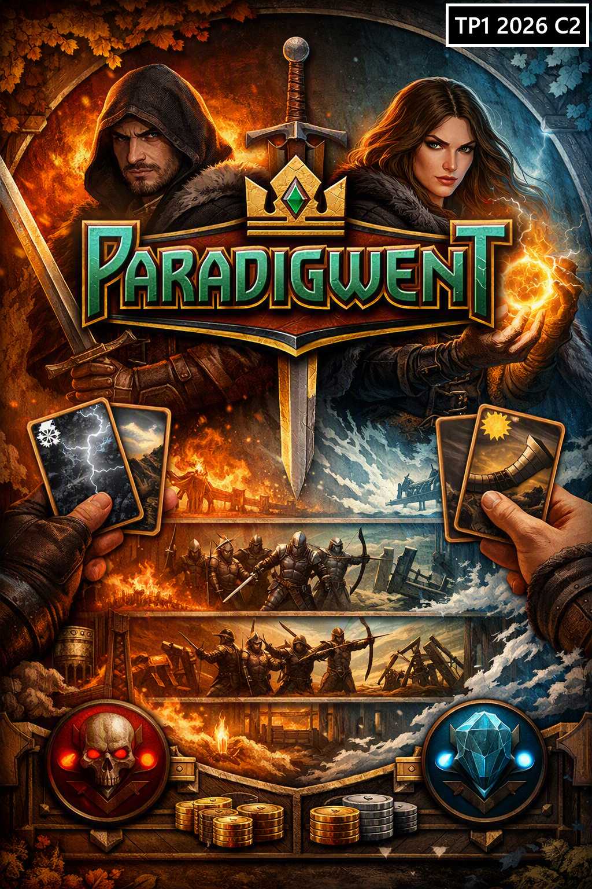

# TP1: PARADIGWENT
{: .no_toc }

**Paradigmas de Programación - FIUBA**  
**Enunciado de Trabajo Práctico 1**

1. Índice
{:toc}

---

## Objetivo

Implementar una versión propia del estilo del juego de cartas **Gwent** (marca registrada), que denominaremos Paradigwent, aplicando conceptos de **Programación Orientada a Objetos (POO)** y principios de buen diseño de software. Nuestro juego se llamará Paradigwent.

---

## Referencias

A modo ilustrativo, se adjuntan referencias del juego Gwent original. Paradigwent prescinde de algunos elementos y simplifica otros, según se detalla en secciones siguientes.

- 📖 [Reglas de Gwent en Wikipedia](https://witcher.fandom.com/wiki/Gwent)
- 🎥 [Partida Completa de GWENT Ejemplo](https://www.youtube.com/watch?v=XLcEuosKT8Y)

### Simplificaciones Principales Respecto del Juego Gwent Original

- No implementamos cartas de "Rey/Líder"
- No implementamos "héroes"
- Menos cartas de "Efectos Especiales" (se detalla en el apartado de "Mazo de Cartas")

---

## Reglas del Juego Paradigwent

Las siguientes reglas delimitan la jugabilidad esperada. No obstante, en caso de encontrarlo necesario, el grupo puede extender alguna regla particular en acuerdo con su corrector, siempre que no contradiga el set de reglas básico.

### Dinámica de juego

- Paradigwent es un juego de cartas por turnos entre dos jugadores, de los cuales uno será la computadora.
- El juego consiste en "rondas" en que los jugadores juegan "turnos" de forma alternada.
- Se sortea qué jugador tiene primero su Turno. Por cada Turno se puede jugar una sola carta. 
- Ambos jugadores inician el Juego con 10 cartas en la "Mano" obtenidas de su mazo por sorteo. Esta mano es única para toda la Partida, sin reposición de cartas. El resto de las cartas inicia en el "Mazo". La "Mano" consiste en las cartas que el jugador tiene a disposición para jugar y poner en el tablero.
- Los jugadores inician con tres "Vidas". Se pierde una vida al perder o empatar una "Ronda". Un jugador pierde el juego al quedarse sin "vidas".
- Dentro de una ronda, en cada "turno" el jugador puede jugar una sola carta o "pasar". El jugador que "pasa" ya no vuelve a jugar turnos en esa ronda. Si queda un solo jugador, este repite turnos hasta "pasar" también.
- Cuando ambos jugadores "pasan", se evalúa al ganador de la ronda. Para esto, se evalúa la Fuerza de cada jugador en el tablero, considerando criaturas de ataque, clima y efectos especiales. Gana la Ronda el que más "Fuerza" haya podido agrupar.En caso de empate, ambos pierden una vida, sino el perdedor solamente pierde una vida.
- El ganador de una ronda es el que reúna más puntos de ataque entre todas sus cartas jugadas en el tablero, considerando también las cartas de Efecto (Criaturas con Habilidad, Clima, Cartas de Efecto).
- Al finalizar una ronda se limpia el tablero de ambos jugadores y todas las cartas jugadas anteriormente van a la pila de "Descarte".
- Las cartas que son eliminadas al terminar una Ronda o por efecto de una habilidad especial se mueven a la pila de "Descarte".
- Hay tres tipos de cartas: 
  - Criatura
  - Efecto
  - Clima
- Las criaturas pueden tener tres tipos de ataque. En el tablero, para cada jugador las criaturas se juegan en una "Línea de Ataque" específica según su tipo de ataque:
    - Cuerpo a Cuerpo
    - Ataque a Distancia
    - Asedio
- Las criaturas tienen una "Fuerza de Ataque", que se suma para computar a la Fuerza al finalizar una Ronda. Algunas critaturas además pueden tener una Habilidad o Efecto Especial (similar a las cartas de Efecto).
- Las Cartas de Efecto pueden afectar a otras cartas. A este efecto se pueden adjuntar a otra carta o una línea de ataque (Cuerpo a Cuerpo/Distancia/Asedio).
- Las cartas de "Clima" modifican a todas las cartas en juego. Solamente puede haber una carta de clima en el tablero en juego (al jugarse una carta de Clima se envía cualquier otra anteriomente en juego al "Descarte").

### Tablero de Juego

- Resolución fija de referencia: puede ser de **800x600 píxeles** o superior, a criterio del equipo.  
- El escenario incluye:
  - Un tablero de base
  - Zona de Cartas de Clima (afectan a ambos jugadores)
  - Una sección para cada Jugador, que contendrá:
    - Pila de cartas (Mazo)
    - Pila de descarte
    - Cartas en Mano
    - Zonas de Cartas en Juego, con sus 3 secciones:
      - Ataque Cuerpo a Cuerpo
      - Ataque a Distancia
      - Asedio
    - Zona de Puntaje de Ronda (valor numérico de Fuerza acumulada, se actualizará según estado del tablero en cada Turno)
    - Indicador de Vidas (3 inicialmente para cada jugador)

### Mazo de Cartas
- Las cartas deberán tener un mínimo de 3 faccinoes distintas diferenciables.
- Al iniciar un juego, se sorteará una facción distinta para cada jugador.
- Las facciones se diferenciarán por color de cartas. 
- Estética y  odrán tener otras diferencias, a criterio del equipo, en términos de atributos, fortalezas y debilidades, etc.
- Cada facción tendrá un mínimo de 30 cartas diferentes.
- Cada facción deberá tener al menos **3 cartas de clima**, **2 cartas de efectos** y **2 cartas de criatura con habilidades especiales** y **23 criaturas comunes**.
- Deberá haber por facción:
  - 9 Criaturas de Ataque Cuerpo a Cuerpo (espaderos, lanceros, etc.)
  - 7 Criaturas de Ataque a Distancia (arqueros, magos, etc.)
  - 7 criaturas de Asedio (catapultas, máquinas, magos de asedio, etc.)
- Los "Efectos" de cartas pueden ser de criaturas con habilidades especiales, de clima y cartas de Efectos. Se recomienda tomar inspiración en elementos del juego original. A modo de sugerencia:
  - La criatura objetivo duplica Fuerza de Ataque
  - Elimina del tablero a la criatura objetivo (se mueve a "Descarte")
  - Tomar determinadas cartas de el "Mazo"
  - Resucitar carta del "Descarte"
  - Toda la Fila de Ataque objetivo (Cuerpo a Cuerpo/Distancia/Asedio) duplica Fuerza de Ataque
- Las cartas de clima afectan a todo el tablero, mientras que las de efectos a un grupo de cartas objetivo (por ejemplo, toda una fila de cartas, propia o enemiga, o a una carta específica).
- Las cartas de habilidades pueden afectar a otras cartas de habilidades.
- Los efectos de las cartas de habilidades y de clima son de aplicación inmediata. Pueden modificar el estado del tablero, así como el efecto de las cartas ya jugadas (en cuyo caso el impacto deberá reflejarse en el tablero de estado de juego).

### Enemigos

- El adversario será siempre la computadora. 
- El adversario elegirá alguna de las cartas de su mano para continuar jugando o podrá decidir terminar la mano actual también si tiene esa posibilidad.
- La IA es de libre interpretación por parte del equipo. La partida debe resultar razonablemente jubable

---

## Aplicación de temas y conceptos

- Programación Orientada a Objetos  
- Principios de diseño (bajo acoplamiento, alta cohesión, DRY, KISS, SOLID, etc.)  
- Interfaces gráficas con **JavaFX**  
- Gestión de dependencias con **Maven**

---

## Contexto del Proyecto

El juego debe estar dividido en al menos dos capas de abstracción:

- **Modelo**: cartas, jugadores, rondas, turnos, etc.  
- **Vista/Presentación**: renderizado gráfico, sonidos, interacción con el usuario.  

Las clases del modelo **no deben depender** de JavaFX ni de clases de la vista.

---

## Carga de Niveles

El juego tiene un único nivel. No obstante, el Juego deberá tener un menú de inicio con una imagen de portada. Se puede utilizar la provista u otra propia. Una vez iniciado un Juego, existirá en todo momento la posibilidad de "Rendirse". Además, cuando se termina un juego o el jugador se rinde, deberá salir una notificación con el resultado del Juego y luego se pasará al menú de inicio nuevamente.

---

## Interfaz

- Menú de inicio con:
  - Imagen de bienvenida
  - **Iniciar juego** 
  - **Salir**.
- Pantalla de Juego con Escenario: ver sección [Escenario](#escenario)
- Flujos:
  - Menú de Inicio -> Partida -> Victoria → cartel de victoria → Menú de Inicio.  
  - Menú de Inicio -> Partida -> Derrota → cartel de derrota → Menú de Inicio.
- Interactividad (Mouse, Teclado o Ambas):
  - Se podrá seleccionar la carta mediante desplazamiento con teclas de flecha y confirmando con ENTER. Para este caso, deberá ser accesible una opción de "Pasar" y además "Rendirse", a fin de dar acceso a todas las acciones posibles al jugador a partir del teclado. El grupo podrá definir el uso de teclas a este fin.
  - Alternativamente se podrá utilizar el Mouse. Para esto se jugarán cartas haciendo click en las mismas y habrá botones de acción en el tablero para las distintas acciones posibles.
  - Los grupos pueden implementar una o ambas formas de interacción.

---

##  Gráficos y Sonidos

- Cada grupo debe obtener o generar sus propios **sprites y sonidos**.  
- Se recomienda mantener coherencia visual y sonora.  
- No infringir derechos de autor de material de uso restringido. Mencionar licencias de uso en archivo README del TP y acreditar autores de material ajeno citando las fuentes cuando corresponda, según licencia de uso (si se requiere acreditación).
- Se puede generar contenido digital con IA.
- Los sonidos deben ser música de fondo en bucle y efectos para los siguientes eventos clave del juego:
  - juego de carta (fin de turno)
  - pase de jugador (deja de jugar la Ronda)
  - fin de Ronda
  - sonidos de Efecto
  - sonidos de Clima
  - victoria
  - derrota
- Respecto de las cartas, se puede utilizar un diseño sencillo

  Otros sonidos quedan a criterio de diseño del equipo, eventualmente a acordar con el tutor/corrector.

### Sitios recomendados

- **[OpenGameArt.org](https://opengameart.org/)**  
  Repositorio comunitario de sprites, tilesets, íconos y efectos visuales para videojuegos. Todo el material está bajo licencias libres (Creative Commons, GPL, etc.), ideal para proyectos académicos.

- **[Freesound.org](https://freesound.org/)**  
  Biblioteca colaborativa de efectos de sonido y música, con licencias abiertas. Permite descargar y reutilizar sonidos siempre que se respeten las condiciones de atribución.

- **[Pixabay](https://pixabay.com/sound-effects/)**  
  Además de imágenes, ofrece música y efectos de sonido libres de derechos, aptos para uso no comercial y académico.

### Assets provistos por la catedra (Opcionales)

Para este trabajo la cátedra no provee assets de referencia, salvo la portada. Se puede utilizar la portada para el menú de inicio, si se desea. Las cartas podrán llevar o no un sprite ilustrativo.

### Observación

Se debe verificar siempre la **licencia específica** de cada recurso descargado (imagen/sonido), ya que algunos requieren atribución explícita al autor. El uso de material con licencias abiertas es obligatorio para evitar problemas legales o de derechos de autor.
Si algún recurso requiere atribución, se debe mencionarlo en el archivo **README.md** del proyecto.

---

## Requerimientos Funcionales

- Implementación completa de las reglas descritas.
- Implementación de la visualización de estado del tablero y del estado del juego.
- Se debe poder completar partidas de punta a punta.
- La IA debe presentar un comportamiento "razonable" para mantener una jugabilidad mínima.

Extras opcionales para mejor nota:
- Animaciones en sprites, desplazamiento de cartas, efectos visuales, efectos de sonido adicionales, diseño con criterio estético, etc. Se evalúa primariamente la aplicación de conceptos de la materia y no tanto cuestiones de diseño artístico. Se puede alcanzar la nota más alta con excelente código y un diseño sencillo.

---

## Requerimientos No Funcionales

- Lenguaje: **Java**
- Interfaz: **JavaFX**.
- Dependencias: **Maven**.
- Repositorio: **GitHub**.
- Separación clara entre modelo y vista.
- Definición de mazos de cartas en archivos JSON / XML (Resources).

---

## Documentación Escrita

Debe incluir:

- Diagrama de Clases UML del modelo.  
- Archivo `readme.md` con:
  - Universidad, Facultad, Materia.  
  - Docentes y corrector.  
  - Integrantes del grupo.  
  - Nombre del proyecto.  
  - Descripcion breve del proyecto.
  - Instrucciones de ejecución.
  - Instrucciones de juego (reglas y controles).
  - Formato `.xml` utilizado para la carga de niveles

  
### Observación

 **El archivo readme.md debe ser creado y completado al inicio del desarrollo del trabajo práctico para que se pueda asignar el docente corrector al grupo. Sin este archivo, la cátedra no podrá identificar al grupo y podrían perder la regularidad de no cumplir este requerimiento a tiempo. Se debe completar el readme al crear el repositorio al menos con los datos básicos del proyecto y alumnos, para completar luego más adelante las instrucciones detalladas para la ejecución del programa y las reglas del juego. Se REQUIEREN INMEDIATAMENTE los datos de los alumnos al comienzo del TP.**

---

## Pruebas y Optimización

- No se requiere optimización avanzada de física o renderizado
- Pruebas automáticas: **opcionales**, solo para clases del modelo
  - Se recomienda:
    - Al menos **1 test de integración** (integración entre clases)
    - Tests unitarios de **3 clases distintas**
	- No es obligatorio usar mockito

---

## Documentación Audiovisual

Cada integrante debe presentar un video individual que cumpla con:

- Duración: **5 a 10 minutos**
- Debe verse la **cara del expositor**
- Mostrar el juego funcionando (máximo 1 minuto)
- Explicar:
  - Diseño de clases
  - Uso de polimorfismo
  - Principios de diseño respetados y no respetados y criterior aplicado

---

## Entrega y Gestión de Repositorio

La entrega se realiza mediante **GitHub**, en equipos de **2 integrantes**.

### Pasos para vinculación:

1. Crear un repositorio en GitHub con archivo .gitignore estándar para maven/IntelliJ/Java.
2. Configurar proyecto maven con javafx compilable y ejecutable ("Hola Mundo con JavaFX").
3. Crear archivo README.md con los datos de los integrantes del grupo y la información general.
4. Enviar el enlace una sola vez por el grupo del repo por mensaje privado a Santiago Maraggi (JTP), indicando integrantes por apellido y padrón.
5. Dar permiso de acceso a los Docentes Diego Essaya (dessaya) y Santiago Maraggi (smaraggi-fiuba).
6. Se dará acceso al Tutor/Corrector adicionalmente una vez asignado.

### Repositorio

- GitHub permite dar acceso por usuarios
- Entrega oficial: mediante **Pull Request**
  - Indicar rama de entrega; el pull request apuntará a la rama principal (main)
  - Estado del proyecto
  - Condiciones de ejecución
- Se recomienda clonar el repositorio en limpio para verificar funcionamiento antes de entregar
- Al aprobarse, los cambios deben quedar todos integrados a la **rama principal** (main)

>  *El archivo `readme.md` debe ser el primer archivo incluido en el repositorio, INMEDIATAMENTE AL INICIARSE EL TP CON LOS DATOS DE LOS INTEGRANTES DEL GRUPO.*

### Observaciones

- Cada equipo debe tener **un único repositorio compartido**
- La entrega será válida **solo si ambos integrantes están correctamente vinculados**
- No crear el repositorio manualmente; se genera al aceptar la invitación
- Los repositorios son PRIVADOS para los integrantes del grupo. Queda prohibido compartir su contenido y dar accesos a otros alumnos.
- Ante dudas o problemas técnicos, contactar al equipo docente con anticipación

---

## Trabajo de Referencia

Se incluye un ejemplo para ilustrar la **separación en capas** y el uso de **Canvas en JavaFX** para renderizar en tiempo real.

- Juego: implementación de **Pong** para dos jugadores
- Controles por teclado
- Descargable y ejecutable

 [Repositorio de referencia - Pong](https://github.com/algoritmos3ce/pong)

## Criterios de Corrección

### Principios de Programación evaluados

El código será analizado en función de los siguientes principios:

- **Tell, Don’t Ask**
- **Principle of Least Astonishment**
- **Principle of Least Knowledge**
- **Don't Repeat Yourself (DRY)**
- **YAGNI (You Ain't Gonna Need It)**
- **Keep It Simple, Stupid (KISS)**
- **Explicit Dependencies Principle**
- **Knuth's Optimization Principle**
- **Separation of Concerns**
- **Principios SOLID**

> Se busca lograr **bajo acoplamiento** y **alta cohesión** en el diseño de clases.

---

### Aspectos específicos a evaluar

- Jugabilidad completa según reglas de juego descritas
- Se puede ganar el juego jugándolo completo.
- Reinicio del juego sin salir de la aplicación a través del menú principal
- Corrección del diagrama de clases
- Video individual por integrante, con exposición clara de decisiones de diseño
- Elegancia y legibilidad del código
- Uso correcto del paradigma de **Programación Orientada a Objetos**
- Aplicación de **polimorfismo** en los enemigos y torretas.
- Diseño de clases según principios vistos
- Separación adecuada entre **vista** y **lógica**
- Ausencia de dependencias del modelo hacia la vista o clases de JavaFX
- Manejo correcto de archivos de nivel.
- Inexistencia de errores en tiempo de ejecución y correcta gestión de errores de archivo.
- Las contribuciones de todos los integrantes del grupo al proyecto deben ser significativas

---

## Prácticas prohibidas

- Variables globales o `static` (excepto constantes).  
- Métodos o clases excesivamente largas (código spaghetti).  
- Uso de `instanceof` para distinguir tipos que violen OCP y TDA.

---

## Entrega y Nota

- La entrega debe realizarse dentro del plazo indicado como **"fecha límite de entrega"** en el calendario de la materia.
- Si no se cumple con esta fecha, el trabajo será considerado **desaprobado** y no se aceptarán entregas posteriores.

### Evaluación

- Una vez recibido el trabajo, el corrector decidirá si está **aprobado o no**.
- Si se aprueba, se asignará una **nota entre 4 y 10**.
- Se contempla **una única instancia de reentrega**, dentro del plazo de la **"fecha límite de aprobación"**, tanto si el trabajo fue aprobado como si no.

> *Es responsabilidad del grupo cumplir con los plazos y condiciones establecidos por la cátedra.*

---
