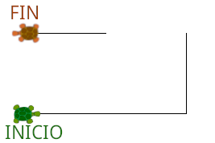
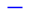
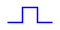
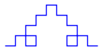
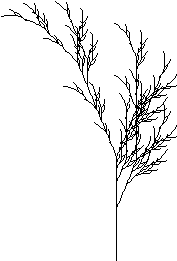
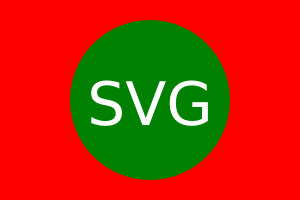
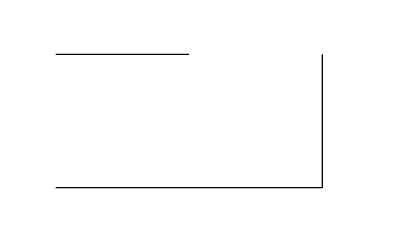

# TP2: Sistemas-L
{: .no_toc }

1. Índice
{:toc}

## Introduccion

La excéntrica coleccionista de arte Czarina Halenur quiere redecorar su
lujosa mansión, y para ello encargó una serie de cuadros a los famosos artistas
post-modernos Taigas Agiogram e Italics Carnaroli.

Luego de una ardua reunión de _brainstorming_, la temática elegida resultó ser
imágenes generadas por computadora. Los artistas subcontratarán al mejor equipo
de arte digital de los últimos 50 años: el curso de Paradigmas de Programación
"Ergos Iodic - Adagio Yeses" de FIUBA. El jurado estará compuesto por los bohemios Gitano
Scoriac, Defi Tannic, Vans Acta Amancheriez, Lazzi Lacsulu y Rejoneadora
Ballon Amtrac.

## Consigna

Implementar un programa en **Clojure** que permita generar imágenes fractales, mediante un
algoritmo basado en **sistemas-L**, una simulación de **gráficos tortuga** y el
formato de imágenes estándar **SVG**. Explicaremos a continuación cada uno de
estos conceptos.

## Gráficos tortuga

Fuente: [Wikipedia](https://es.wikipedia.org/wiki/Gr%C3%A1ficas_tortuga)

**Gráficos tortuga** es un método para generar imágenes usando un cursor
(la **tortuga**) relativo a unas coordenadas cartesianas.

La tortuga tiene tres atributos:

* Una **posición** en el plano (que puede expresado en coordenadas cartesianas con
  dos números reales `(x, y)`). La tortuga comienza en la posición `(0, 0)`.
* Una **orientación** (expresada como un ángulo).
* Una **pluma**, teniendo atributos como color, ancho y un indicador de pluma
  arriba y abajo. La tortuga comienza con la pluma abajo.

La tortuga se mueve con comandos relativos a su posición, como "adelante 10" y
"gira a la izquierda 90°". Si la pluma está "abajo", la tortuga dibujará una
línea recta cada vez que avance.

{: .nota }
El módulo [`turtle`](https://docs.python.org/3/library/turtle.html) de
Python contiene una implementación de gráficos tortuga y puede ser útil para
entender su funcionamiento.

Por ejemplo, la siguiente secuencia de comandos:

```
adelante 200
izquierda 90
adelante 100
izquierda 90
pluma arriba
adelante 100
pluma abajo
adelante 100
```

generaría la siguiente imagen (siendo la posición inicial de la tortuga abajo a
la izquierda mirando hacia la derecha, y mostrando la tortuga en su posición
final, arriba a la izquierda):



En nuestra implementación, la tortuga deberá ser capaz de responder, al menos, a
los siguientes comandos:

* `adelante(n)`: Avanza n unidades en la dirección actual. Si la pluma está
  abajo, dibuja una línea recta entre las posiciones inicial y final.
* `derecha(α)`, `izquierda(α)`: Gira según el ángulo `α` a la derecha o
  izquierda.
* `pluma_arriba()`, `pluma_abajo()`: Asigna el estado de la pluma.

## Sistemas-L

Fuente: [Wikipedia](https://es.wikipedia.org/wiki/Sistema-L)

Un **sistema-L** o un **sistema de Lindenmayer** es un conjunto de símbolos y
reglas que tiene una naturaleza recursiva y que permite, entre otras cosas,
generar imágenes [fractales](https://es.wikipedia.org/wiki/Fractal).

Un sistema-L está formado por:

* un **alfabeto**: el conjunto de todos los símbolos válidos.
* un **axioma**: Una cadena de símbolos del alfabeto que define el estado inicial del sistema.
* un conjunto de **reglas de transformación**: Cada regla de transformación
  consiste de una cadena predecesora y una cadena sucesora.

{: .nota }
En nuestra implementación solo vamos a soportar cadenas predecesoras
formadas por un único caracter.

Por ejemplo:

* Alfabeto: `F+-`
* Axioma: `F`
* Reglas:
    * `F → F+F-F-F+F`

Este sistema tiene una sola regla de transformación, en la que el predecesor es
la cadena `F`, y el sucesor es `F+F-F-F+F`. Según esta regla, podemos procesar
el sistema-L comenzando con el axioma y reemplazando símbolos en forma
iterativa:

```
0. F
1. F+F-F-F+F
2. F+F-F-F+F+F+F-F-F+F-F+F-F-F+F-F+F-F-F+F+F+F-F-F+F
3. ...
```

Podríamos seguir indefinidamente, en este caso generando una cadena cada vez
más larga.

Otro ejemplo, esta vez con dos reglas:

* Alfabeto: `FG+-`
* Axioma: `F-G-G-`
* Reglas:
    * `F → F-G+F+G-F`
    * `G → GG`

El procesamiento de este sistema produce:

```
0. F-G-G-
1. F-G+F+G-F-GG-GG-
2. F-G+F+G-F-GG+F-G+F+G-F+GG-F-G+F+G-F-GGGG-GGGG-
3. ...
```

## Conectando los sistemas-L con gráficos tortuga

En todos nuestros sistemas-L usaremos como alfabeto los caracteres ASCII, y a
cada sistema le asignaremos además un ángulo `α`.

Nuestras imágenes serán generadas asignando una operación de la tortuga a cada
caracter, de la siguiente manera:

* `F` o `G`: Avanzar una unidad
* `f` o `g`: Pluma arriba, avanzar una unidad, pluma abajo
* `+`: Girar a la derecha `α`
* `-`: Girar a la izquierda `α`
* `|`: Invertir la dirección (es decir, girar 180°)

Además, contaremos con una **pila** de tortugas, y la tortuga activa será
siempre la que está en el tope de la pila. Los siguientes comandos controlarán
la pila:

* `[`: Apilar una nueva tortuga, que arranca con el mismo estado (posición,
  orientación y pluma) que la tortuga que estaba previamente en el tope.
* `]`: Desapilar (la tortuga que estaba en el tope se descarta).

Cualquier caracter que no tenga asignada una operación (es decir, que no sea
uno de los listados arriba), será ignorado.

Veamos cómo quedan las imágenes con el sistema-L visto anteriormente:

* Axioma: `F`
* Reglas:
    * `F → F-F+F+F-F`
* `α`: 90

```
0. F
```


```
1. F-F+F+F-F
```


```
2. F-F+F+F-F+F-F+F+F-F+F-F+F+F-F+F-F+F+F-F+F-F+F+F-F
```


Otro ejemplo: un sistema que hace uso de la pila con los símbolos `[` y `]`:

* Axioma: `X`
* Reglas:
    * `F → FF`
    * `X → F+[[X]-X]-F[-FX]+X`
* `α`: 22.5

Con este sistema, luego de varias iteraciones se genera la siguiente imagen:



## Archivo de descripción del sistema-L

Nuestro programa deberá cargar la información del sistema-L a partir de un
archivo con el siguiente formato:

```
<ángulo>
<axioma>
<predecesor1> <sucesor1>
<predecesor2> <sucesor2>
<predecesor3> <sucesor3>
...
```

Por ejemplo, el sistema del ejemplo anterior se puede codificar en un archivo
`arbol.sl`:

```
22.5
X
F FF
X F+[[X]-X]-F[-FX]+X
```

Disponemos de una colección de [sistemas-L de
ejemplo](./tp3-2019-c1-lsystems.zip)
para descargar en la sección _Material_.

## El formato SVG

Fuente: [Wikipedia](https://es.wikipedia.org/wiki/Gr%C3%A1ficos_vectoriales_escalables)

**Scalable Vector Graphics** o **SVG** es un formato de archivo basado en
[XML](https://es.wikipedia.org/wiki/Extensible_Markup_Language) que permite
codificar imágenes. Un ejemplo de una imagen simple codificada en formato SVG
es:

```
<svg viewBox="0 0 300 200" xmlns="http://www.w3.org/2000/svg">
  <rect width="300" height="200" fill="red" />
  <circle cx="150" cy="100" r="80" fill="green" />
  <text x="150" y="125" font-size="60" text-anchor="middle" fill="white">SVG</text>
</svg>
```

Si guardamos esto en un archivo llamado `imagen.svg`, podemos visualizar la
imagen generada en cualquier programa capaz de interpretar archivos SVG. En
particular, cualqueir navegador web moderno (por ejemplo Firefox o Chrome)
puede abrir y mostrar archivos SVG.



Una imagen generada por una tortuga estará compuesta por una secuencia de
líneas. Una forma de traducir esto en formato SVG es usando una secuencia de
elementos `<line>`. Por ejemplo, la imagen generada a partir del ejemplo
en la sección _Gráficos tortuga_ se puede codificar en SVG así:

```
<svg viewBox="-50 -150 300 200" xmlns="http://www.w3.org/2000/svg">
  <line x1="0" y1="0" x2="200" y2="0" stroke-width="1" stroke="black" />
  <line x1="200" y1="0" x2="200" y2="-100" stroke-width="1" stroke="black" />
  <line x1="100" y1="-100" x2="0" y2="-100" stroke-width="1" stroke="black" />
</svg>
```



{: .nota }
Por omisión SVG utiliza un sistema de coordenadas en el cual el eje Y
crece hacia abajo, y por eso utilizamos coordenadas negativas en `y1` e `y2`.

Notar que el atributo `viewBox` permite controlar la "ventana" del plano que
será visible en la imagen. Los 4 números son `x-mínimo`, `y-mínimo`, `ancho` y
`alto`. En nuestro ejemplo, la esquina superior izquierda de la ventana es
`(-50, -150)` y la inferior derecha es `(250, 50)`, y de esta forma dejamos un
margen para que el dibujo no quede demasiado cercano a los bordes.

Otra forma equivalente de codificar la misma imagen es utilizando un único elemento
`<path>`.  La imagen generada es exactamente igual; el contenido del archivo es
un poco más críptico pero la ventaja es que ocupa menos espacio. Dentro del
atributo `d` usamos los comandos `M x y` para movernos a las coordenadas `(x,
y)` y `L x y` para movernos dibujando una línea recta:

```
<svg viewBox="-50 -150 300 200" xmlns="http://www.w3.org/2000/svg">
  <path d="M 0 0 L 200 0 L 200 -100 M 100 -100 L 0 -100" stroke-width="1" stroke="black" fill="none"/>
</svg>
```


Con estos ejemplos es suficiente para la implementación del TP. Para más
información acerca del formato SVG, consultar la [documentación de SVG en
MDN](https://developer.mozilla.org/es/docs/Web/SVG).

## El programa

El proyecto debe estar programado en Clojure utilizando Leiningen.

El programa debe recibir tres parámetros por la línea de comandos (que se
recibirán como parámetros en la función `-main`):

* el nombre del archivo que contiene la descripción del sistema-L
* la cantidad de iteraciones a procesar
* el nombre del archivo SVG a escribir

Por ejemplo:

```
$ lein run arbol.sl 3 arbol.svg
```

Utilizar los [sistemas-L de
ejemplo](./tp3-2019-c1-lsystems.zip)
provistos en la sección _Material_ para verificar que el programa funciona
correctamente.

{: .importante }
No se permite utilizar ninguna función que produzca efectos secundarios,
excepto aquellas necesarias para leer y escribir archivos.

## ¡Extras!

{: .nota }
Esta sección es completamente _opcional_ y solo deberían intentar hacerla si ya
cumplieron con los requisitos antes descriptos.

A último minuto, Czarina Halenur decidió que le gustaría que su arte tenga
ciertas características que se le atribuyen a la pintura pos-modernista. Los mismos deberían incluír:

* Incrementar/disminuir el grosor de la pluma (Ver qué acepta la propiedad `stroke-width` del tag `line` o `path`)
* Cambiar el color (Ver qué colores acepta la propiedad `stroke` del tag `line` o `path`)
* Dibujar una hoja (por ejemplo, se puede usar el tag `<circle/>` de SVG.)
* Permitir que el ángulo sea diferente para derecha e izquierda.

Experimentar el agregado de la funcionalidad extra en los [ejemplos](./tp3-2019-c1-lsystems.zip).

Por ejemplo. Modificando las reglas del `arbol3.sl` a:

```
F -> Fa2[+Fb1]F[-Fa1]Fb5L
```

donde

* `a`: Cambiar a color Azul
* `b`: Cambiar a color Rojo
* `1`: Cambiar el grosor de la pluma a 1
* `2`: Cambiar el grosor de la pluma a 2
* `L`: Dibujar un círculo

podemos dibujar un árbol de colores con grosores distintos y círculos en las
hojas!

Hay total libertad en la definición de las reglas, se puede utilizar cualquier
simbología con cualquier significado (como poner un cuadrado en las hojas, o un
[emoji](https://github.com/twitter/twemoji/tree/gh-pages/svg)).

## Entrega

**Fecha de entrega:** 13 de junio 2024

**Fecha límite para aprobar:** 27 de junio 2024

* El código debe estar alojado en un repositorio **privado** de Github.
    - Ver [Uso de Git y Github](/entorno/git-y-github/)
    - Agregar al repositorio un archivo `README.md` con el nombre y padrón de los integrantes del grupo.
    - Dar acceso al usuario `dessaya`.

## Material

<a href="./tp3-2019-c1-lsystems.zip" class="btn btn-default btn-lg">sistemas-l.zip</a>

Ejemplos de archivos `.sl` con definiciones de sistemas-L.

<hr/>

<a href="./tp3-2019-c1-lsystems-svg.zip" class="btn btn-default btn-lg">sistemas-l-svg.zip</a>

Archivos SVG generados a partir de los sistemas-L de ejemplo.

