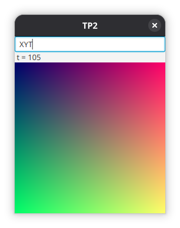

# TP2
{: .no_toc }

1. Índice
{:toc}

## Introducción

El objetivo del TP2 es desarrollar un programa que permite generar
una animación mediante un lenguaje de programación sencillo.

Se evaluarán los siguientes conceptos:

* Programación funcional (el programa debe ser escrito en lenguaje Clojure)
* Programación orientada a eventos
* Interfaces gráficas
* Concurrencia

## La animación

El programa generará una animación de 256 cuadros. Cada cuadro es una imagen
de 256 x 256 pixeles. Cada pixel está compuesto por 3 valores enteros R, G, B
entre 0 y 255.

## Interfaz gráfica

La interfaz gráfica debe consistir, por lo menos, de una ventana no
redimensionable con:

* Un campo de texto donde el usuario puede ingresar el código a ejecutar.
* Una etiqueta donde se muestra el valor actual del tiempo `t` (entre 0 y 255),
  o un mensaje de error en caso de que el código sea inválido.
* La animación de 256x256 pixels.

Se busca que la animación se reproduzca aproximadamente a 10 cuadros por
segundo, aunque no es un requerimiento que la velocidad de reproducción sea
precisa y constante. Como la animación tiene 256 cuadros, la duración total
debe ser de aproximadamente 25 segundos.

Cuando el usuario modifica el código, se debe reiniciar el tiempo `t` a 0.

## Ejecución por línea de comandos

El proyecto debe estar implementado utilizando la herramienta **Leiningen**.

Al ejecutarlo con `lein run` debe arrancar con el campo de texto vacío esperando
a que el usuario ingrese algún código.

Al ejecutarlo con `lein run <codigo>` debe inicializar el campo de texto
con el código.

## Máquina virtual

El valor de cada pixel se puede calcular mediante una **función pura**, que recibe:

- El código a ejecutar (String de hasta 1024 caracteres)
- Las coordenadas `x, y` del pixel (0-255)
- El tiempo actual `t` (0-255)

Y devuelve:

- El color del pixel `R, G, B` (0-255)

El código se ejecuta en una **máquina virtual** que tiene el siguiente estado:

- El contador de programa (`IDX`), un número entero que indica el próximo comando
  del código a evaluar. Inicia en 0.
- Una pila de datos (`DS`), que almacena hasta 8 números enteros de 32 bits. Inicia vacía.
- Una pila de ciclos (`LS`), que almacena la información necesaria para
  ejecutar ciclos. Capacidad máxima 8. Inicia vacía.
- Un valor entero `M` que puede ser 0, 1 o 2. Se usa para determinar el comportamiento ante
  división por 0. Inicia en 0.

Por cada pixel, la máquina virtual se inicializa en el estado inicial, y
luego se evalúan los comandos del código uno por uno, incrementando `IDX`,
hasta que `IDX` llega al final del código.

Al finalizar la ejecución, se toman los 3 valores que están en el tope de `DS`
como los valores R, G, B del pixel. Si la pila tiene menos de 3 valores,
se asume que los valores faltantes son 0. Por ejemplo, si la pila es `[30 50]`
(50 en el tope), quedará `R = 0`, `G = 30`, `B = 50`).
Si alguno de los valores no está en el rango 0-255, se produce un error.

En caso de error al ejecutar el código (por ejemplo si se intenta apilar
un valor y la pila está llena, o desapilar de una pila vacía), la ejecución
de la máquina virtual finaliza inmediatamente (¡pero la aplicación no se debe
colgar!).

## Comandos

A continuación el listado de comandos que puede ejecutar la máquina virtual.

Si el código contiene un caracter que no es un comando válido, se produce un error.

----

{: .comando }
`X`

Apila en `DS` el valor de la coordenada `x`.

----

{: .comando }
`Y`

Apila en `DS` el valor de la coordenada `y`.

----

{: .comando }
`Z`

Apila en `DS` el valor de la coordenada `y`.

----

{: .comando }
`N`

Apila en `DS` el valor 0.

----

{: .comando }
`0` - `9`

Multiplica el valor en el tope de `DS` por 10, y le suma el valor del dígito decimal.

Por ejemplo, `N126`:

1. `N` Apila `0`.
1. `1` Queda `0 * 10 + 1 = 1`
1. `2` Queda `1 * 10 + 2 = 12`
1. `6` Queda `12 * 10 + 5 = 126`

El siguiente código, entonces, genera una imagen de un color pleno violeta pastel: `N146N111N218`

----

{: .comando }
`C`

Clamp: Si el valor en el tope de `DS` es negativo, se reemplaza por 0. Si es mayor a 255, se reemplaza por 255.

Por ejemplo, el código `XY+` produce un error cuando el valor es mayor a 255, mientras que `XY+C` no.

----

{: .comando }
`D`

Apila el valor que está en el tope de `DS`.

----

{: .comando }
`P`

Desapila un valor de `DS` y lo descarta.

----

{: .comando }
`S`

Intercambia los 2 valores en el tope de `DS`.

----

{: .comando }
`R`

Rota los 3 valores en el tope de `DS`. `[... a b c] -> [... b c a]`

----

{: .comando }
`!`

Se desapila un valor `a` de `DS`. Si `a` es 0, se apila 1. En caso contrario
se apila 0.

----

{: .comando }
`+`

Desapila `b`. Desapila `a`. Apila `a + b`.

Por ejemplo, el código `N70N50+` deja 120 en `DS`.

----

{: .comando }
`-`

Desapila `b`. Desapila `a`. Apila `a - b`.

----

{: .comando }
`*`

Desapila `b`. Desapila `a`. Apila `a * b`.

----

{: .comando }
`^`

Desapila `b`. Desapila `a`. Apila `a ^ b`. (operación de bits XOR).

----

{: .comando }
`&`

Desapila `b`. Desapila `a`. Apila `a & b`. (operación de bits AND).

----

{: .comando }
`|`

Desapila `b`. Desapila `a`. Apila `a | b`. (operación de bits OR).

----

{: .comando }
`=`

Desapila 2 valores. Apila 1 si son iguales, 0 en caso contrario.

Por ejemplo, el código `XY=N255*` muestra una línea diagonal azul.
El código `XY=!N255*` muestra una línea diagonal negra sobre un fondo azul.

----

{: .comando }
`<`

Desapila `b`. Desapila `a`. Apila 1 si `a < b`, 0 en caso contrario.

----

{: .comando }
`>`

Desapila `b`. Desapila `a`. Apila 1 si `a > b`, 0 en caso contrario.

----

{: .comando }
`/`

Desapila `b`. Desapila `a`.

Si `b` es 0:
- Si el modo `M` es 0, la ejecución de la máquina virtual finaliza con un error.
- Si el modo `M` es 1, se ignora el error y la ejecución de la máquina virtual finaliza con el valor del pixel `RGB = 0, 0, 0`.
- Si el modo `M` es 2, se ignora el error y la ejecución de la máquina virtual finaliza con el valor del pixel `RGB = 255, 0, 0`.

En caso contrario, apila `a / b` (división entera).

----

{: .comando }
`%`

Desapila `b`. Desapila `a`.

Si `b` es 0: mismo comportamiento que `/`.

En caso contrario, apila `a % b` (resto de la división entera).

Nota: Hay diferentes [variantes](https://en.wikipedia.org/wiki/Modulo#Variants_of_the_definition)
de la operación "modulo" cuando los operandos son negativos. En este caso se busca el
modulo según la división euclídea. Para calcularlo en Clojure: `(mod (rem a b) (abs b))`.

Por ejemplo, el código `NN8-N5%` deja 2 en `DS`.

----

{: .comando }
`M`

Incrementa el valor de `M`. Si es 2 pasa a ser 0.

Por ejemplo:
- El código `XY%` produce un error.
- El código `MXY%` produce una imagen en la que algunos pixeles son negros indicando el error.
- El código `MMXY%` produce una imagen en la que algunos pixeles son rojos indicando el error.

----

{: .comando }
`[`

Marca el inicio de un ciclo.

Desapila un valor `a` de `DS`, que se usará como contador.

Si `a` es positivo, se apila en `LS` los valores de `IDX + 1` y `a`.
Luego se incrementa `IDX` y comienza la ejecución del ciclo.

En caso contrario, se saltea la ejecución del ciclo. En este caso se busca el `]`
correspondiente en el código (teniendo en cuenta los `[]` anidados), y se reemplaza
el valor de `IDX` por la posición del `]`.

----

{: .comando }
`]`

Marca el fin de un ciclo.

Se decrementa el contador en el tope de `LS`.

Si el contador es positivo, se debe iterar una vez más. Se reemplaza `IDX` por el valor en el tope de `LS`.

En caso contrario, se incrementa `IDX` continuando la ejecución en el siguiente comando luego de `]`.

## Pruebas

Se ofrece la siguiente tabla con casos de prueba para la función pura que evalúa
el color de un pixel:

| Código | x, y, t | R, G, B |
|--------|---------|---------|
| (vacío) | 1, 2, 3 | 0, 0, 0 |
| `X` | 1, 2, 3 | 0, 0, 1 |
| `Y` | 1, 2, 3 | 0, 0, 2 |
| `T` | 1, 2, 3 | 0, 0, 3 |
| `XY` | 1, 2, 3 | 0, 1, 2 |
| `XYT` | 1, 2, 3 | 1, 2, 3 |
| `XYTXYTXY` | 1, 2, 3 | 3, 1, 2 |
| `N1` | 1, 2, 3 | 0, 0, 1 |
| `N2` | 1, 2, 3 | 0, 0, 2 |
| `N3` | 1, 2, 3 | 0, 0, 3 |
| `N4` | 1, 2, 3 | 0, 0, 4 |
| `N5` | 1, 2, 3 | 0, 0, 5 |
| `N6` | 1, 2, 3 | 0, 0, 6 |
| `N7` | 1, 2, 3 | 0, 0, 7 |
| `N8` | 1, 2, 3 | 0, 0, 8 |
| `N9` | 1, 2, 3 | 0, 0, 9 |
| `N8N9` | 1, 2, 3 | 0, 8, 9 |
| `N7N8N9` | 1, 2, 3 | 7, 8, 9 |
| `N0N1N2N3N4N5N6N7` | 1, 2, 3 | 5, 6, 7 |
| `N4N4N4N4***N1-` | 1, 2, 3 | 0, 0, 255 |
| `XYD` | 1, 2, 3 | 1, 2, 2 |
| `N4N5N6D` | 1, 2, 3 | 5, 6, 6 |
| `XYP` | 1, 2, 3 | 0, 0, 1 |
| `XYS` | 1, 2, 3 | 0, 2, 1 |
| `XYTS` | 1, 2, 3 | 1, 3, 2 |
| `XYTR` | 1, 2, 3 | 2, 3, 1 |
| `N9XYTR` | 1, 2, 3 | 2, 3, 1 |
| `N9XYTRP` | 1, 2, 3 | 9, 2, 3 |
| `XY+` | 1, 2, 3 | 0, 0, 3 |
| `N1N1+` | 1, 2, 3 | 0, 0, 2 |
| `XYT++` | 1, 2, 3 | 0, 0, 6 |
| `XY+` | 2147483637, 10, 3 | 0, 0, 2147483647 |
| `XY-` | 1, 2, 3 | 0, 0, -1 |
| `XY*` | 3, 2, 1 | 0, 0, 6 |
| `XY*` | -3, 2, 1 | 0, 0, -6 |
| `XY*` | 3, -2, 1 | 0, 0, -6 |
| `XY*` | -3, -2, 1 | 0, 0, 6 |
| `XY/` | 4, 2, 1 | 0, 0, 2 |
| `XY/` | 4, 3, 1 | 0, 0, 1 |
| `XY/` | -4, 3, 1 | 0, 0, -1 |
| `XY/` | 4, -3, 1 | 0, 0, -1 |
| `XY/` | 4, 5, 1 | 0, 0, 0 |
| `XY%` | 4, 5, 1 | 0, 0, 4 |
| `XY%` | 7, 5, 1 | 0, 0, 2 |
| `XY%` | 7, -5, 1 | 0, 0, 2 |
| `XY%` | -7, 5, 1 | 0, 0, 3 |
| `XY%` | -7, -5, 1 | 0, 0, 3 |
| `XY^` | 1, 3, 2 | 0, 0, 2 |
| `XY&` | 1, 3, 2 | 0, 0, 1 |
| <code>XY&#124;</code> | 1, 3, 2 | 0, 0, 3 |
| `X!` | 0, 2, 3 | 0, 0, 1 |
| `X!` | 1, 2, 3 | 0, 0, 0 |
| `Y!` | 1, 2, 3 | 0, 0, 0 |
| `T!` | 1, 2, 3 | 0, 0, 0 |
| `X!` | -1, 2, 3 | 0, 0, 0 |
| `X!` | -2, 2, 3 | 0, 0, 0 |
| `X!!` | 2, 2, 3 | 0, 0, 1 |
| `XY=` | 1, 2, 3 | 0, 0, 0 |
| `XX=` | 1, 2, 3 | 0, 0, 1 |
| `XY<` | 1, 2, 3 | 0, 0, 1 |
| `XY>` | 1, 2, 3 | 0, 0, 0 |
| `XN0[N1+]` | 1, 2, 3 | 0, 0, 1 |
| `XN0N1-[N1+]` | 1, 2, 3 | 0, 0, 1 |
| `XN1[N1+]` | 1, 2, 3 | 0, 0, 2 |
| `N2N3[N4+]` | 1, 2, 3 | 0, 0, 14 |
| `XTX-[N9+]` | 1, 2, 3 | 0, 0, 19 |
| `XTX-[N9+]X` | 1, 2, 3 | 0, 19, 1 |
| `XX-[N4+]` | 1, 2, 3 | 0, 0, 0 |
| `XX-[N4+]X` | 1, 2, 3 | 0, 0, 1 |
| `N0N2[N3[N1+]]` | 1, 2, 3 | 0, 0, 6 |
| `N0N2[N3[N4[N1+]]]` | 1, 2, 3 | 0, 0, 24 |
| `XYTXYTXYT` | 1, 2, 3 | error |
| `NNNNNNNNN` | 1, 2, 3 | error |
| `N0N1N2N3N4N5N6N7N8` | 1, 2, 3 | error |
| `N0N1N2N3N4N5N6N7ND` | 1, 2, 3 | error |
| `P` | 1, 2, 3 | error |
| `XYR` | 1, 2, 3 | error |
| `XS` | 1, 2, 3 | error |
| `X+` | 1, 2, 3 | error |
| `TX-[N1+]` | 1, 2, 3 | error |
| `N0N1[N1[N1[N1[N1[N1[N1[N1[N1[N1+]]]]]]]]]` | 1, 2, 3 | error |
| `XYT+++` | 1, 2, 3 | error |
| `XY+` | 2147483637, 11, 3 | error |
| `XY-` | -2147483638, 11, 3 | error |
| `XY*` | 1073741823, 4, 3 | error |
| `XY*` | -1073741823, -4, 3 | error |
| `XY*` | -1073741824, 4, 3 | error |
| `XY*` | 1073741824, -4, 3 | error |
| `XY/` | 1, 0, 3 | error |
| `XY%` | 1, 0, 3 | error |

## Requerimientos no funcionales

- El proyecto debe estar armado utilizando la herramienta Leiningen.
- El código debe estar separado en al menos dos capas de abstracción: **lógica** y **presentación**.
- La capa lógica debe estar programada en **Clojure**, utilizando **funciones puras**.
- No hay requerimientos específicos acerca de la capa de presentación. Algunas opciones:
  - En Clojure con JavaFX
  - En Clojure con Swing (para evitar la dependencia externa)
  - En Java con JavaFX
- **La ejecución de la capa lógica debe ocurrir en un hilo diferente a la interfaz
gráfica**: no debe ocurrir que la interfaz queda "frizada" mientras se ejecuta
  la máquina virtual.
- Puntos extra por usar todos los cores disponibles para el cálculo de la animación.
- Puntos extra por lograr que la animación se ejecute en forma fluida.

Todos los requerimientos son **mínimos**. Se permite agregar elementos adicionales
a la interfaz y al lenguaje de la máquina virtual.

## Documentación Audiovisual

Cada integrante debe presentar un video individual que cumpla con:

- Duración: **5 a 10 minutos**
- Debe verse la **cara del expositor**
- Mostrar el programa funcionando (máximo 1 minuto)
- Explicar:
  - Flujo del programa
  - Funcionamiento de las secciones de código más relevantes
  - Dónde se crean los hilos y cómo se logra la concurrencia

## Entrega y Gestión de Repositorio

La entrega se realiza mediante **GitHub Classroom**, en equipos de **2 integrantes**.

### Pasos para vinculación

1. Acceder al enlace: [GitHub Classroom TP2](https://classroom.github.com/a/xyz)
2. Un integrante:
   - Crea un grupo (máximo 2 personas)
   - Asigna un nombre identificable y académico
3. El segundo integrante:
   - Ingresa al mismo enlace
   - Se une al grupo creado

### Repositorio

- GitHub genera automáticamente el repositorio compartido
- Entrega oficial: mediante **Issue o Pull Request**
  - Indicar rama de entrega
  - Estado del proyecto
  - Condiciones de ejecución
- Se recomienda clonar el repositorio en limpio para verificar funcionamiento
- Al aprobarse, los cambios deben integrarse a la **rama principal**

{: .nota}
El archivo `readme.md` debe ser el primer archivo incluido en el repositorio, y
debe estar disponible en la rama `main`.
Incluir la información completa del trabajo: título del TP,
universidad, facultad, materia,
nombre del grupo, integrantes,
descripción breve del proyecto,
instrucciones para ejecución, etc.

## Entrega y nota

- La entrega debe realizarse dentro del plazo indicado como **"fecha límite de entrega"** en el calendario de la materia.
- Si no se cumple con esta fecha, el trabajo será considerado **desaprobado** y no se aceptarán entregas posteriores.

### Evaluación

- Una vez recibido el trabajo, el corrector decidirá si está **aprobado o no**.
- Si se aprueba, se asignará una **nota entre 4 y 10**.
- Se contempla **una única instancia de reentrega**, dentro del plazo de la **"fecha límite de aprobación"**, tanto si el trabajo fue aprobado como si no.
