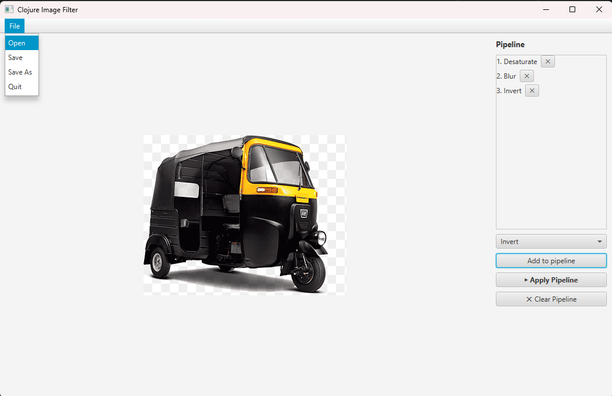

# TP2
{: .no_toc }

1. Índice
   {:toc}

# Trabajo Práctico 2: Procesamiento de imágenes con programación funcional

## Introducción

Se evaluarán los siguientes conceptos:

* Programación funcional (el programa debe ser escrito en lenguaje Clojure)
* Programación orientada a eventos
* Interfaces gráficas
* Concurrencia

## Duración
3 semanas

## Lenguaje principal
Clojure

## Interfaz de usuario
Libre: se permite utilizar Java o Clojure para la interfaz gráfica.



## Grupos de Trabajo
Parejas. Se priorizará mantener el equipo del TP 1.

---

## 1. Consigna general

Desarrollar una aplicación de procesamiento de imágenes basada en **filtros compuestos**. El trabajo debe centrarse en el modelado funcional, la composición de transformaciones y la separación clara entre:

- lógica pura de procesamiento,
- entrada/salida de archivos,
- interfaz de usuario.

El objetivo es construir un sistema que permita cargar una imagen, armar una _pipeline_ de filtros, visualizar el resultado y guardar la imagen procesada.

---

## 2. Objetivos de aprendizaje

Al finalizar el trabajo práctico, el equipo deberá demostrar que puede:

- modelar datos y transformaciones con funciones puras en Clojure;
- componer filtros en un pipeline;
- separar la lógica funcional de la interfaz gráfica y de la persistencia;
- aplicar concurrencia para mejorar la experiencia de usuario durante el procesamiento;
- justificar decisiones de diseño y de implementación.

---

## 3. Interfaz esperada

La interfaz gráfica no debe ser necesariamente idéntica a la captura de referencia, pero sí debe ofrecer una experiencia equivalente a la siguiente:

- una barra de menú o botones con acciones de archivo;
- un área central para visualizar la imagen cargada o procesada;
- un panel lateral para construir y administrar el pipeline de filtros;
- botones para agregar, aplicar y limpiar filtros;
- una forma de quitar pasos individuales del pipeline.

### Referencia visual

> La siguiente figura ilustra la interfaz propuesta para esta práctica. El diseño puede variar, pero debe conservar las funciones principales.

```text
┌──────────────────────────────────────────────────────────────────────────────┐
│ Archivo                                                                      │
│ ┌───────────────┐                                                            │
│ │ Abrir         │                                                            │
│ │ Guardar       │                                                            │
│ │ Guardar como  │                                                            │
│ │ Salir         │                                                            │
│ └───────────────┘                                                            │
│                                                                              │
│                     [ Área principal de visualización ]                      │
│                          imagen cargada / procesada                          │
│                                                                              │
│                                                           Filtros            │
│                                                           ┌───────────────┐  │
│                                                           │ 1. Desaturar  │× │
│                                                           │ 2. Difuminado │× │
│                                                           │ 3. Invertir   │× │
│                                                           └───────────────┘  │
│                                                           [ selector ▼ ]     │
│                                                           [ Agregar ]        │
│                                                           [ Aplicar ]        │
│                                                           [ Reset ]          │
└──────────────────────────────────────────────────────────────────────────────┘
```

### Comportamiento esperado de la interfaz

- **Abrir**: abre una imagen desde disco.
- **Guardar**: guarda la imagen actual en el mismo archivo, si existe uno asociado.
- **Gurdar como**: guarda la imagen actual en un archivo elegido por el usuario.
- **Filtros**: muestra la secuencia de filtros seleccionados.
- **selector**: permite elegir un filtro para agregar al pipeline.
- **Agregar**: agrega el filtro seleccionado al final del pipeline.
- **×**: elimina un filtro individual del pipeline.
- **Apply Pipeline**: aplica todos los filtros en orden sobre la imagen original cargada.
- **Reset**: vacía el pipeline y restaura la imagen original.

---

## 4. Alcance funcional obligatorio

### 4.1 Núcleo funcional
Implementar un módulo puro de procesamiento de imágenes donde las transformaciones no dependan de la interfaz gráfica.

### 4.2 Filtros mínimos
El trabajo debe incluir al menos **tres filtros**:

1. un filtro puntual por píxel (por ejemplo desaturar, invertir, brillo, colorizar),
2. un filtro por vecindad o convolución (por ejemplo difuminado, realce, detección de bordes),
3. un tercer filtro libre a elección del grupo.

#### Guía rápida de los ejemplos de filtros

A continuación se describe, de forma general, qué hace cada filtro propuesto y una idea posible de implementación en el núcleo funcional:

- **Desaturar**  
  Convierte la imagen a escala de grises eliminando la información de color.
  Implementación general: para cada píxel, calcular un valor de luminancia (por ejemplo, promedio o combinación ponderada de R, G y B) y asignarlo por igual a los tres canales.

- **Invertir**
  Invierte los colores, generando el negativo de la imagen.  
  Implementación general: para cada canal de cada píxel, usar `nuevo = 255 - valor` (o el máximo del rango correspondiente).

- **Brillo**  
  Aumenta o reduce el brillo global de la imagen.  
  Implementación general: sumar (o restar) una constante a cada canal por píxel y recortar el resultado al rango válido (por ejemplo, 0..255).

- **Difuminado**
  Suaviza la imagen reduciendo detalle fino y ruido local.  
  Implementación general: aplicar una convolución con un _kernel_ de suavizado (por ejemplo, caja 3x3 o gaussiano), reemplazando cada píxel por una combinación de sus vecinos.

- **Realce**  
  Realza bordes y detalles para que la imagen se vea más nítida.  
  Implementación general: aplicar un _kernel_ de realce (convolución) o combinar la imagen original con una versión suavizada para destacar altas frecuencias.

Más información:

- https://en.wikipedia.org/wiki/Digital_image_processing#Digital_image_transformations
- https://ai.stanford.edu/~syyeung/cvweb/tutorial1.html
- https://lodev.org/cgtutor/filtering.html

### 4.3 Pipeline editable
Debe ser posible construir y editar un pipeline de filtros antes de ejecutarlo.

El pipeline debe permitir:
- agregar filtros al final,
- quitar filtros individuales,
- limpiar toda la secuencia,
- aplicar la secuencia completa sobre la imagen original.

### 4.4 Carga y guardado
La aplicación debe permitir cargar imágenes desde disco y guardar el resultado procesado.

### 4.5 Paralelismo
Para que la aplicación no se sienta bloqueada y para mejorar el rendimiento aprovechando múltiples _cores_, se requiere al menos lo siguiente:

- La aplicación debe ejecutar **Apply Pipeline** en segundo plano para no bloquear la interfaz.
- Mientras se procesa, la UI debe reflejar que hay una tarea en curso (por ejemplo, deshabilitar botones, mostrar "Procesando..." y/o cambiar el puntero del mouse a un reloj).
- Al finalizar, la imagen mostrada debe actualizarse con el resultado.
- **Opcionalmente**: paralelizar el cálculo de cada filtro dividiéndolo por segmentos de imagen (filas, bloques, etc.), aprovechando múltiples cores. Nota: cada píxel de salida es independiente porque lee de la imagen original (inmutable para ese filtro).

---

## 5. Recomendación técnica de implementación

Para simplificar el desarrollo y la corrección, se recomienda la siguiente estructura conceptual:

- **`filters.clj`**: funciones puras de procesamiento de imagen.
- **`app.clj`**: interfaz gráfica, estado de la aplicación y manejo de eventos.
- **`core.clj`**: punto de entrada del programa.

---

## 6. Criterios de evaluación

Los requerimientos son **mínimos**. Se permite agregar funcionalidades adicionales
a la interfaz, pero no se evaluarán ni se otorgarán puntos extra por ello.
Se recomienda enfocarse en cumplir los requerimientos mínimos con calidad y claridad.

### Requerimientos no funcionales

- El proyecto debe estar armado utilizando la herramienta Leiningen.
- Se debe poder ejecutar el programa con `lein run`. Deben estar las indicaciones elementales en el README.
- El código debe estar separado en al menos dos capas de abstracción: **lógica** (principalmente los algoritmos de procesamiento de imagen) y **presentación** (GUI).
- La capa lógica debe estar programada en **Clojure**.
- Los filtros deben ser implementados como **funciones puras**.
- No hay requerimientos específicos acerca de la capa de presentación. Algunas sugerencias:
   - En Clojure con JavaFX
   - En Clojure con Swing (para evitar la dependencia externa)
   - En Java con JavaFX
- **La ejecución de la capa lógica debe ocurrir en un hilo diferente a la interfaz
  gráfica**: no debe ocurrir que la interfaz queda "frizada" mientras se ejecuta
  la máquina virtual.
- Puntos extra por usar todos los cores disponibles para el aplicado de los filtros.
- Puntos extra por lograr que el procesamiento se ejecute en forma fluida y con buena experiencia de usuario.

### Documentación Audiovisual

Cada integrante debe presentar un video individual que cumpla con:

- Duración: **5 a 10 minutos**
- Debe verse la **cara del expositor**
- Mostrar el programa funcionando (máximo 1 minuto)
- Mostrar el código, explicando:
   - Flujo del programa
   - Funcionamiento de las secciones de código más relevantes
   - Cómo se implementan los filtros
   - Cómo se logra la concurrencia


### Entrega y Gestión de Repositorio

La entrega se realiza mediante **GitHub Classroom**, en equipos de **2 integrantes**.

#### Pasos para vinculación

Los grupos se han mantenido del TP1. Aceptar invitación para iniciar la tarea en [GitHub Classroom TP2](https://classroom.github.com/a/-EqadU5w).

En caso de necesitar crear un nuevo equipo el flujo debe ser el mismo que en el TP1:
1. Un integrante:
   - Crea un grupo (máximo 2 personas)
   - Asigna un nombre identificable y académico
2. El segundo integrante:
   - Ingresa al mismo enlace
   - Se une al grupo creado

Por excepción se podrá mover integrante de un grupo o crear uno nuevo. Contactarse con la cátedra en caso de necesitar reajuste de equipo y comentar circunstancias que lo ameriten.

#### Repositorio

- GitHub genera automáticamente el repositorio compartido
- Entrega oficial: mediante **Issue o Pull Request**
   - Indicar rama de entrega
   - Estado del proyecto
   - Condiciones de ejecución
- Se recomienda clonar el repositorio en limpio para verificar funcionamiento
- Al aprobarse, los cambios deben integrarse a la **rama principal**

{: .nota}
El archivo `readme.md` debe ser el primer archivo incluido en el repositorio, y
debe estar disponible en la rama `main`.
Incluir la información completa del trabajo: título del TP,
universidad, facultad, materia,
nombre del grupo, integrantes,
descripción breve del proyecto,
instrucciones para ejecución, etc.


### Entrega y nota

- La entrega debe realizarse dentro del plazo indicado como **"fecha límite de entrega"** en el calendario de la materia.
- Si no se cumple con esta fecha, el trabajo será considerado **desaprobado** y no se aceptarán entregas posteriores.

#### Evaluación

- Una vez recibido el trabajo, el corrector decidirá si está **aprobado o no**.
- Si se aprueba, se asignará una **nota entre 4 y 10**.
- Se contempla **una única instancia de reentrega**, dentro del plazo de la **"fecha límite de aprobación"**, tanto si el trabajo fue aprobado como si no.
